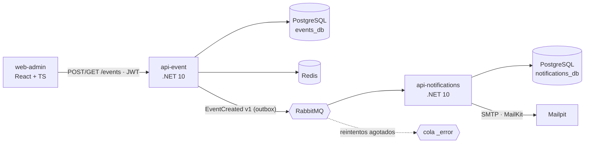

# Plataforma de Eventos Online · Reto Técnico Líder Técnico

Solución al [reto técnico de Líder Técnico](https://github.com/desarrollo-acity/reto_tecnico_lider_tecnico/blob/main/README.md):

1. **Arquitectura** completa de una plataforma de venta de tickets para eventos online (microservicios, eventos, AWS).
2. **Backlog y roadmap** para una primera versión en 6 meses con Scrum.
3. **MVP técnico:** 2 APIs .NET comunicadas por RabbitMQ, PostgreSQL, Redis y una pantalla React para registrar eventos.

## Entregables

| Entregable | Ubicación | Estado |
|---|---|---|
| **A. Diagrama y documento de arquitectura** | [docs/architecture.md](docs/architecture.md) · [docs/decisiones-arquitectura.md](docs/decisiones-arquitectura.md) | ✅ Documentado |
| **B. Backlog y roadmap** | [docs/backlog/Backlog-Roadmap-Plataforma-Eventos.xlsx](docs/backlog/Backlog-Roadmap-Plataforma-Eventos.xlsx) · [docs/backlog-roadmap.md](docs/backlog-roadmap.md) | ✅ Documentado |
| **C. Código del MVP** (backend, frontend, scripts de BD, Docker) | `src/` · `frontend/` · `db/` · `docker-compose.yml` | ⏳ En construcción: diseño en [docs/mvp/](docs/mvp/especificacion-tecnica.md) |

## Documentación

| Documento | Para qué sirve |
|---|---|
| [00-analisis-del-reto.md](docs/00-analisis-del-reto.md) | Interpretación del reto, supuestos y trazabilidad de requisitos → solución → documento |
| [architecture.md](docs/architecture.md) | Arquitectura objetivo: microservicios, flujos sync/async, BD por servicio, seguridad, resiliencia, AWS e híbrido, y la arquitectura del MVP |
| [decisiones-arquitectura.md](docs/decisiones-arquitectura.md) | 14 ADR con alternativas y consecuencias |
| [backlog-roadmap.md](docs/backlog-roadmap.md) | Resumen del plan: fases, hitos, sprints, épicas, dependencias y riesgos |
| [proceso-desarrollo.md](docs/proceso-desarrollo.md) | Scrum, DoR/DoD, áreas de soporte (RACI), entornos DEV → QA → Staging → Producción, CI/CD, documentación a generar |
| [mvp/especificacion-tecnica.md](docs/mvp/especificacion-tecnica.md) | Diseño del MVP: dominio, API, mensajería, idempotencia, BD, seguridad, frontend, compose, pruebas, guion de demo |
| [mvp/plan-de-ejecucion.md](docs/mvp/plan-de-ejecucion.md) | Orden de construcción en 2 días, línea de corte y checklist de entrega |

## Arquitectura del MVP



| Aspecto | Solución |
|---|---|
| Arquitectura | Limpia + DDD (Domain / Application / Infrastructure / Api) por servicio |
| Mensajería | MassTransit 8 + RabbitMQ, **Transactional Outbox**, consumidor **idempotente** por `messageId`, **reintentos** (1 s / 5 s / 15 s) y **DLQ** (`_error` + estado `Failed`) |
| Persistencia | PostgreSQL 17, **una base por servicio**, EF Core 10 con migraciones + `db/init.sql` |
| Caché | Redis, cache-aside en `GET /events` con invalidación por versión |
| Seguridad | JWT con roles (`Admin` crea, `User` lee), ProblemDetails sin detalles internos, rate limiting, logs sin datos sensibles |
| Observabilidad | Serilog en JSON + `X-Correlation-Id` de punta a punta, OpenTelemetry (Jaeger opcional), health checks |
| Frontend | React 19 + TypeScript + Vite + Tailwind, React Hook Form + Zod |

## Cómo ejecutar

> Esta sección refleja el diseño acordado en la [especificación](docs/mvp/especificacion-tecnica.md#13-infraestructura-local). Se valida al terminar la implementación.

**Requisitos:** Docker Desktop o Podman Desktop. Opcional para desarrollo: .NET SDK 10 y Node.js 22.

```bash
cp .env.example .env
docker compose up -d --build
docker compose ps          # todos los servicios en estado healthy
```

| Recurso | URL |
|---|---|
| Frontend (Registrar Evento) | http://localhost:3000 |
| api-event (Scalar / OpenAPI) | http://localhost:5001/scalar/v1 |
| api-notifications | http://localhost:5002/scalar/v1 |
| RabbitMQ Management | http://localhost:15672 |
| Mailpit (correos enviados) | http://localhost:8025 |
| Jaeger (con `--profile observability`) | http://localhost:16686 |

**Token de demo** (solo en `Development`):
```bash
curl -s -X POST http://localhost:5001/auth/dev-token -H "Content-Type: application/json" -d '{"role":"Admin"}'
```

### Migraciones y datos iniciales

- `db/init.sql` crea las bases `events_db` y `notifications_db` con un usuario por servicio.
- En local, cada API aplica sus migraciones EF al arrancar (`Database__ApplyMigrationsOnStartup=true`) y carga 3 eventos de ejemplo.
- Para QA, Staging y Producción se usan los scripts idempotentes de `db/scripts/`.

```bash
dotnet tool install --global dotnet-ef
dotnet ef database update -p src/EventService/EventService.Infrastructure -s src/EventService/EventService.Api
dotnet ef database update -p src/NotificationService/NotificationService.Infrastructure -s src/NotificationService/NotificationService.Api
```

### Pruebas

```bash
dotnet test                              # unitarias + integración (Testcontainers requiere Docker)
cd frontend/web-admin && npm test
```

## Estructura del repositorio

```text
.
├── docs/                    # Documentación (entregables A y B, diseño del MVP)
├── db/                      # init.sql + scripts idempotentes generados desde migraciones
├── src/
│   ├── BuildingBlocks/Contracts/
│   ├── EventService/        # Domain · Application · Infrastructure · Api · Dockerfile
│   └── NotificationService/ # Domain · Application · Infrastructure · Api · Dockerfile
├── tests/
├── frontend/web-admin/      # React + Vite + TS · Dockerfile
├── docker-compose.yml
└── .env.example
```
