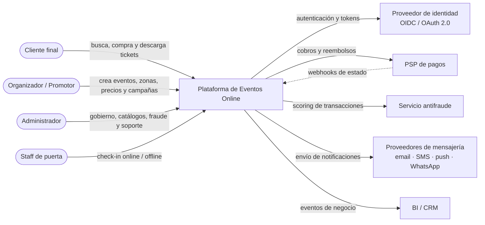
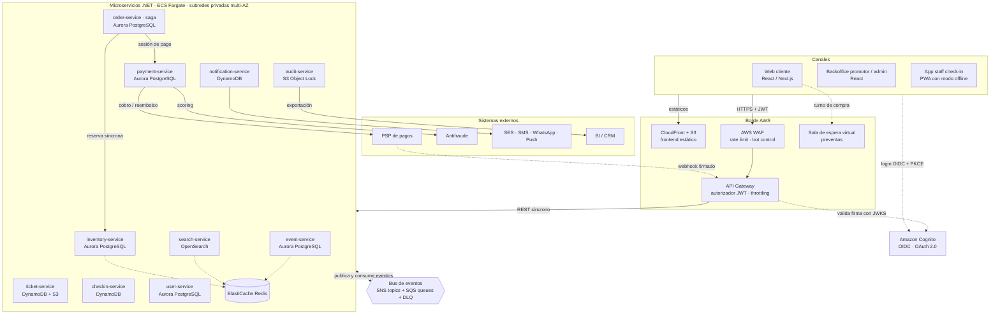
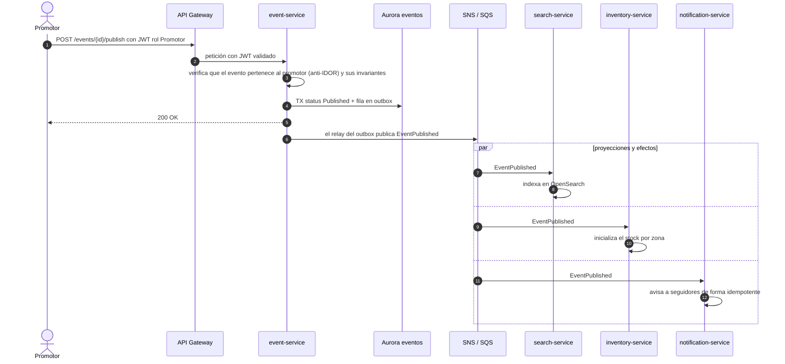
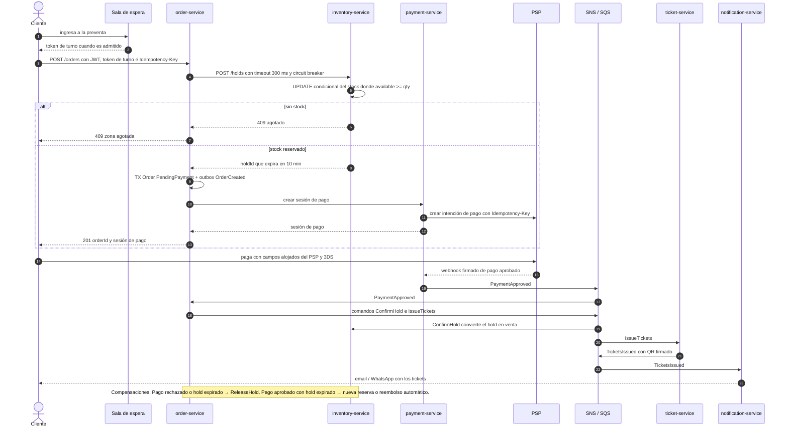
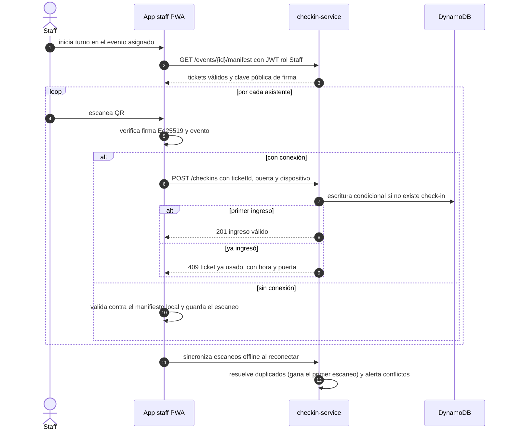
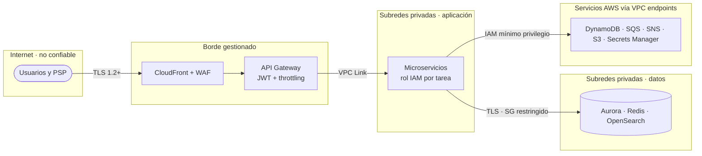
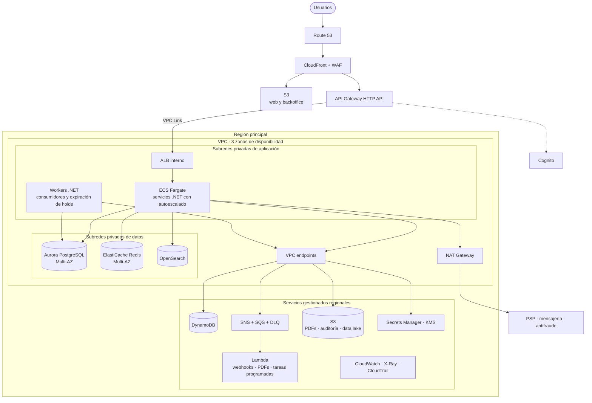
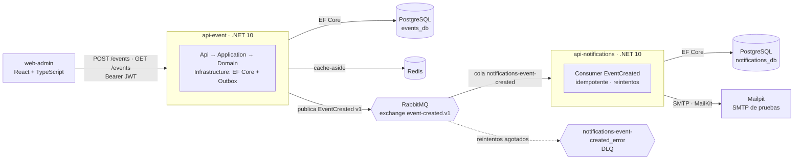

# Arquitectura — Plataforma de Eventos Online

> **Entregable A del reto.** Arquitectura objetivo de la plataforma completa (versión 1.0 a 6 meses) y el subconjunto que implementa el MVP técnico.
> Decisiones detalladas en [decisiones-arquitectura.md](decisiones-arquitectura.md) · Diseño del MVP en [mvp/especificacion-tecnica.md](mvp/especificacion-tecnica.md).

| Versión | Fecha | Autor | Estado |
|---|---|---|---|
| 1.0 | 2026-09-26 | Líder Técnico | Propuesta para revisión del área de Arquitectura |

---

## 1. Sustentación en breve

| Necesidad del negocio | Decisión | Por qué |
|---|---|---|
| Evolucionar por dominios (promociones, marketplace, BI) sin romper lo existente | **Microservicios por bounded context**, cada uno dueño de sus datos | Equipos y despliegues independientes, fallas aisladas y escalado por servicio |
| Desacoplar servicios y absorber picos | **Arquitectura orientada a eventos** con broker (SNS + SQS en AWS, RabbitMQ en local), a través de **MassTransit** | Los efectos secundarios (búsqueda, notificaciones, auditoría) no bloquean la venta y las colas nivelan la carga. MassTransit permite cambiar de transporte sin tocar el código de negocio |
| **Cero sobreventa** con alta concurrencia | Inventario con **actualización condicional atómica** en PostgreSQL, **reservas temporales (holds)** y **sala de espera virtual** | La base de datos garantiza la invariante (`available >= 0`) y la sala de espera limita la concurrencia a lo que el sistema soporta |
| Publicar eventos sin perder mensajes | **Transactional Outbox** en productores e **Inbox idempotente** en consumidores | Entrega *at-least-once* con procesamiento *effectively-once* |
| Compra que involucra inventario, pago y emisión | **Saga orquestada** con compensaciones | Consistencia eventual controlada, sin transacciones distribuidas |
| Búsqueda rápida y flexible | **CQRS**: modelo de lectura en OpenSearch alimentado por eventos, más caché en Redis | Consultas complejas sin cargar la base de datos transaccional |
| Identidad para 4 tipos de actor y sistemas externos | **OIDC / OAuth 2.0** con IdP gestionado (Amazon Cognito) y **JWT** validado en el borde y en cada servicio | Estándar, federable con el IdP corporativo, sin gestión propia de contraseñas |
| Disponibilidad y operación | **AWS multi-AZ**: ECS Fargate, Aurora, DynamoDB, SNS/SQS, más OpenTelemetry e IaC con Terraform | Servicios gestionados, autoescalado, trazabilidad de punta a punta y entornos reproducibles |

---

## 2. Drivers de arquitectura (atributos de calidad)

> Las cifras son **supuestos de diseño** que deben validarse con el Product Owner y confirmarse con pruebas de carga (Sprint 11).

| Atributo | Objetivo | Cómo se logra |
|---|---|---|
| Concurrencia en preventa | Hasta 100.000 usuarios en la sala de espera; más de 500 reservas/s sostenidas y picos de 1.500/s | Sala de espera, holds atómicos, autoescalado de ECS, colas |
| Consistencia de inventario | **0 sobreventas** (invariante de negocio) | `UPDATE` condicional + `CHECK (available >= 0)` + transacción hold/stock |
| Latencia | Búsqueda p95 < 300 ms · reserva p95 < 800 ms · check-in online p95 < 500 ms | Redis, OpenSearch, índices, sin llamadas síncronas encadenadas |
| Disponibilidad | 99,9 % en venta y check-in | Multi-AZ, degradación controlada, check-in offline |
| Recuperación | RPO ≤ 5 min · RTO ≤ 1 h (servicios core) | Aurora con PITR, AWS Backup entre regiones, IaC para reconstruir |
| Auditabilidad | Toda operación de negocio trazable (quién, qué, cuándo, desde dónde) | Eventos de dominio → audit-service (S3 Object Lock), `correlationId` de punta a punta |
| Seguridad | OWASP ASVS nivel 2 · alcance PCI DSS mínimo (sin datos de tarjeta) | OIDC, WAF, cifrado, campos alojados del PSP, mínimo privilegio |
| Evolución | Agregar un consumidor nuevo sin modificar productores | Pub/sub con contratos versionados |

---

## 3. Contexto del sistema (C4 · nivel 1)



---

## 4. Listado de microservicios

| # | Microservicio | Responsabilidad (bounded context) | Datos que posee | Motor de BD | Expone (sync) | Publica (async) | Consume (async) |
|---|---|---|---|---|---|---|---|
| 1 | **event-service** | Eventos, recintos, zonas, precios, aforos, reglas de venta, ciclo de vida | Eventos, zonas, reglas | Aurora PostgreSQL | REST backoffice + detalle público | `EventCreated`, `EventUpdated`, `EventPublished`, `EventCancelled` | — |
| 2 | **search-service** | Búsqueda avanzada de eventos publicados (texto, filtros, facetas, geo) | Índice de lectura (proyección) | Amazon OpenSearch + Redis | `GET /search` | — | Eventos del catálogo, `StockChanged` |
| 3 | **inventory-service** | Aforo por zona o asiento, reservas temporales (holds), prevención de sobreventa | Stock, holds | Aurora PostgreSQL | `POST /holds` (interno) | `HoldCreated`, `HoldExpired`, `StockChanged` | `EventPublished`, `EventCancelled`, `ConfirmHold`, `ReleaseHold` |
| 4 | **order-service** | Órdenes y orquestación de la saga de compra y reembolso | Órdenes, estado de la saga, claves de idempotencia | Aurora PostgreSQL | `POST /orders`, `GET /me/orders` | `OrderCreated`, `OrderPaid`, `OrderCancelled` y comandos | `PaymentApproved`, `PaymentRejected`, `TicketsIssued`, `HoldExpired` |
| 5 | **payment-service** | Integración con el PSP, webhooks, conciliación, reembolsos y antifraude | Transacciones (ledger), conciliaciones | Aurora PostgreSQL | Sesión de pago (interno), webhook del PSP | `PaymentApproved`, `PaymentRejected`, `RefundCompleted` | `RefundPayment` |
| 6 | **ticket-service** | Emisión de tickets con QR firmado, PDF, reenvío y transferencia | Tickets, PDFs | DynamoDB + S3 | `GET /me/tickets` | `TicketsIssued` | `IssueTickets`, `EventCancelled` |
| 7 | **checkin-service** | Validación de ingreso online y offline, manifiestos por puerta, aforo en tiempo real | Check-ins | DynamoDB | `POST /checkins`, `GET /events/{id}/manifest` | `CheckedIn` | `TicketsIssued` |
| 8 | **notification-service** | Notificaciones multicanal, plantillas, preferencias y trazabilidad de envíos | Log de envíos, plantillas | DynamoDB | `GET /notifications` (soporte) | `NotificationSent`, `NotificationFailed` | Eventos de negocio relevantes |
| 9 | **user-service** | Perfil, preferencias, consentimientos y promotores (la identidad vive en el IdP) | Perfiles, organizaciones | Aurora PostgreSQL | `GET/PUT /me` | `UserRegistered`, `PromoterApproved` | Eventos del IdP |
| 10 | **audit-service** | Registro inmutable de operaciones y exportación a BI | Log de auditoría | S3 Object Lock + Athena | Consulta de auditoría (Admin) | — | Todos los eventos de negocio |

> **Transversales:** Amazon Cognito (identidad), API Gateway (borde), ElastiCache Redis (caché, rate limiting, turnos de la sala de espera) y Lambda (webhooks, PDFs, tareas programadas).
> **Futuro (evolución):** `pricing-promotion-service` y `marketplace-service` (reventa) se suman como consumidores y productores del bus sin modificar los servicios existentes.

---

## 5. Vista de contenedores (C4 · nivel 2)



**Lectura del diagrama:** las flechas desde el borde son **HTTP síncrono**. Todo lo que pasa por el **bus** es **asíncrono** (quién publica y quién consume cada mensaje está en §4 y §6.1). Ningún servicio accede a la base de datos de otro.

---

## 6. Comunicación síncrona vs. asíncrona

**Regla general**
- **Síncrono (REST/HTTPS)** solo cuando el usuario **necesita la respuesta para continuar**: consultas, reserva de stock, check-in online. Se limita a **un salto** entre servicios (cliente → servicio → como máximo un servicio más) y siempre con *timeout*, reintento acotado y *circuit breaker*.
- **Asíncrono (eventos y comandos por cola)** para **propagar estado** entre contextos, **efectos secundarios** (notificar, indexar, auditar), **procesos largos** (pago, emisión) e **integraciones**.
  - **Eventos** (`EventPublished`, pub/sub en SNS → N colas SQS): hechos ocurridos; el productor no conoce a los consumidores.
  - **Comandos** (`IssueTickets`, cola SQS punto a punto): el orquestador de la saga pide una acción a un destinatario.

| Caso de uso | Tipo | Mecanismo | Justificación |
|---|---|---|---|
| Buscar eventos | Síncrono | `GET` search-service (Redis → OpenSearch) | El usuario espera el resultado |
| Crear o editar evento | Síncrono + asíncrono | REST → `EventCreated` / `EventUpdated` | Confirmación inmediata; la búsqueda y la auditoría se actualizan de forma eventual |
| Publicar evento | Síncrono + asíncrono | REST → `EventPublished` → search, inventory, notification, audit | Un hecho, varios interesados |
| Reservar tickets (hold) | Síncrono | order → inventory `POST /holds` | Se necesita confirmar el stock en el momento |
| Confirmar pago | Asíncrono | Webhook del PSP → `PaymentApproved` | Latencia externa variable, reintentos del PSP |
| Emitir tickets | Asíncrono | Comando `IssueTickets` | Nivelación de carga en picos |
| Notificar | Asíncrono | Eventos → notification-service | Nunca debe bloquear ni tumbar la compra |
| Reembolso o cancelación de evento | Asíncrono (saga) | `EventCancelled` → reembolsos masivos | Proceso largo con compensaciones |
| Check-in online | Síncrono | `POST /checkins` | Respuesta inmediata en la puerta |
| Check-in offline | Asíncrono (lote) | Sincronización al reconectar | Tolerancia a fallas de red en el recinto |
| Auditoría y BI | Asíncrono | Suscripción a todos los eventos | Desacoplado del flujo transaccional |

### 6.1 Catálogo de mensajes (integración)

| Mensaje | Tipo | Productor | Consumidores |
|---|---|---|---|
| `EventCreated` v1 | Evento | event-service | notification (MVP), audit, search |
| `EventPublished` / `EventUpdated` / `EventCancelled` | Evento | event-service | search, inventory, order, notification, audit |
| `HoldCreated` / `HoldExpired` / `StockChanged` | Evento | inventory-service | order, search (disponibilidad aproximada), audit |
| `OrderCreated` / `OrderPaid` / `OrderCancelled` | Evento | order-service | notification, audit, BI |
| `PaymentApproved` / `PaymentRejected` / `RefundCompleted` | Evento | payment-service | order, notification, audit |
| `TicketsIssued` | Evento | ticket-service | order, checkin (manifiesto), notification, audit |
| `CheckedIn` | Evento | checkin-service | audit, BI (aforo en tiempo real) |
| `ConfirmHold` / `ReleaseHold` / `IssueTickets` / `RefundPayment` | Comando | order-service (saga) | inventory / ticket / payment |

**Sobre estándar** (todos los mensajes): `messageId` (UUID, clave de idempotencia), `correlationId` (traza de negocio), `causationId`, `occurredAt` (ISO-8601 UTC), `version`, `producer`. Además, `traceparent` W3C viaja en las cabeceras para el trazado distribuido.
**Versionado:** los cambios aditivos mantienen la versión. Un cambio incompatible crea `vN+1` en un tópico nuevo y el productor publica ambas versiones durante la transición.

---

## 7. Flujos clave

### 7.1 Publicación de un evento (sync + async)



### 7.2 Compra con alta concurrencia (saga orquestada)



### 7.3 Check-in online y offline



---

## 8. Persistencia políglota

**Principio:** *database per service*. Cada servicio es el único que lee y escribe su esquema; los demás obtienen esos datos por API o por eventos. Para optimizar costos se puede **compartir un clúster Aurora** entre servicios de baja carga, con **bases y usuarios separados** (propiedad lógica). Los servicios críticos (inventario, órdenes y pagos) tienen clúster propio.

| Servicio | Motor | Justificación |
|---|---|---|
| event-service | **Aurora PostgreSQL** | Agregado evento + zonas con reglas e integridad referencial. El outbox va en la misma transacción |
| search-service | **Amazon OpenSearch** (+ Redis) | Texto completo, facetas, filtros geográficos y relevancia. Es un modelo de lectura reconstruible a partir de los eventos |
| inventory-service | **Aurora PostgreSQL** | Consistencia fuerte: `UPDATE` condicional atómico, `CHECK`, transacción hold + stock |
| order-service | **Aurora PostgreSQL** | Órdenes y estado de la saga, transaccional, consultas por usuario |
| payment-service | **Aurora PostgreSQL** | Ledger ACID, conciliación, clave única por idempotencia y por evento del PSP |
| ticket-service | **DynamoDB** + **S3** | Alto volumen con acceso por clave (`ticketId`, GSI por `userId` y `eventId`), escalado automático. PDFs en S3 |
| checkin-service | **DynamoDB** | Escrituras condicionales (anti doble ingreso) de baja latencia en la apertura de puertas |
| notification-service | **DynamoDB** | Log de envíos con mucha escritura, esquema flexible por canal, TTL para retención |
| user-service | **Aurora PostgreSQL** | Perfiles, organizaciones, consentimientos |
| audit-service | **S3 Object Lock** + **Athena** | Inmutabilidad (WORM), bajo costo, consultas ad hoc |
| Transversal | **ElastiCache Redis** | Caché del catálogo y de búsquedas, rate limiting, turnos de la sala de espera, idempotencia de corta vida |

> En el **MVP** ambos servicios usan **PostgreSQL** (requisito del reto) con una **base por servicio** en la misma instancia local. La notificación en PostgreSQL es válida para el MVP. En la arquitectura objetivo se evalúa moverla a DynamoDB según el volumen real.

---

## 9. Consistencia y prevención de sobreventa

1. **Admisión controlada:** en eventos de alta demanda, la **sala de espera virtual** ([Virtual Waiting Room on AWS](https://aws.amazon.com/solutions/implementations/aws-virtual-waiting-room/)) emite turnos a un ritmo configurable según la capacidad medida en las pruebas de carga. Así se protege todo el backend y no solo el inventario.
2. **Reserva atómica** (entrada general por zona):
   ```sql
   UPDATE zone_stock
      SET available = available - @qty, version = version + 1
    WHERE zone_id = @zoneId AND available >= @qty
   RETURNING available;          -- 0 filas afectadas → agotado
   -- Red de seguridad: CHECK (available >= 0)
   ```
   El `INSERT` del hold (con `expires_at`) ocurre en la **misma transacción**.
3. **Asientos numerados:** una fila por asiento con `UPDATE seats SET status='Held' WHERE seat_id = ANY(@ids) AND status='Available'`. La operación es todo o nada: si las filas afectadas son menos que las pedidas, se hace *rollback*.
4. **Expiración de holds:** un *worker* libera en lotes los holds vencidos (`FOR UPDATE SKIP LOCKED`) y devuelve el stock en la misma transacción. Publica `HoldExpired`.
5. **Zonas muy calientes:** *sharding* del contador (la zona se divide en N buckets) para reducir la contención de una sola fila.
6. **Redis nunca es la fuente de verdad del stock.** Solo muestra una disponibilidad aproximada, que se actualiza con `StockChanged`.
7. **Idempotencia en la API:** `POST /orders` y los pagos aceptan `Idempotency-Key`, de modo que los reintentos del cliente o los dobles clics no crean órdenes duplicadas.

---

## 10. Seguridad

### 10.1 Identidad y flujos OAuth 2.0 / OIDC

| Cliente | Flujo | Detalle |
|---|---|---|
| Web cliente y backoffice (SPA) | **Authorization Code + PKCE** (OIDC) | Access token de 15 min, refresh token con rotación. Tokens en memoria, no en `localStorage`. Para el backoffice se recomienda el patrón **BFF** con cookie `HttpOnly` |
| App staff (PWA) | Authorization Code + PKCE | Sesión atada al evento asignado. El modo offline usa un manifiesto firmado de vigencia limitada |
| Servicio a servicio | **Client Credentials** con *scopes* por recurso | Además, aislamiento de red con *security groups* por servicio |
| Webhooks del PSP | Firma HMAC + lista de IP permitidas | Idempotente por id de evento del PSP |
| Staff y admin corporativos | Federación SAML/OIDC con el IdP corporativo | Opción híbrida (ver §13.3) |

**Validación del JWT** en API Gateway (autorizador JWT) **y** en cada servicio (defensa en profundidad): firma RS256 contra el JWKS del IdP, `iss`, `aud`, `exp`/`nbf`, lista permitida de algoritmos y *clock skew* máximo de 30 s.

### 10.2 Roles y autorización

| Acción | Cliente | Promotor | Admin | Staff |
|---|---|---|---|---|
| Buscar y ver eventos publicados | ✔ (también anónimo) | ✔ | ✔ | ✔ |
| Crear, editar y publicar eventos | — | ✔ solo los suyos | ✔ | — |
| Comprar, ver sus órdenes y tickets | ✔ solo los suyos | — | ✔ soporte (auditado) | — |
| Reembolsos | Solicita (los suyos) | Según la política de su evento | ✔ | — |
| Check-in | — | — | ✔ | ✔ solo eventos asignados |
| Catálogos, fraude, configuración | — | — | ✔ | — |
| Reportes de ventas | — | ✔ los suyos | ✔ | — |

- **RBAC** con roles del IdP (`cognito:groups`) y **políticas** en .NET (`[Authorize(Policy = "CanManageEvents")]`).
- **Autorización por recurso contra IDOR:** los endpoints “míos” filtran siempre por `sub` u `org_id` del token, nunca por un id recibido del cliente. Las acciones sobre recursos pasan por un *handler* de autorización que verifica la propiedad. Los UUID no son un control de seguridad.

### 10.3 Límites de confianza y protección de datos



- **Cifrado:** TLS 1.2+ en tránsito y KMS en reposo (Aurora, DynamoDB, S3, SQS, Redis).
- **Secretos:** AWS Secrets Manager con rotación. Nada de secretos en el código ni en las imágenes.
- **Pagos:** tokenización y campos alojados del PSP. La plataforma **no almacena ni procesa PAN**, lo que reduce el alcance PCI DSS (SAQ A).
- **Datos personales:** minimización, consentimientos en user-service, enmascarado en logs y retención y borrado según la normativa local de protección de datos.
- **AppSec:** OWASP ASVS nivel 2. SAST, SCA, escaneo de imágenes y DAST en el pipeline. Pentest antes del go-live.
- **Detección y gobierno:** CloudTrail, GuardDuty, Security Hub y AWS Config. Alarmas de seguridad hacia el área de Seguridad.
- **Anti-abuso:** reglas de tasa del WAF por IP, *bot control* en preventas, throttling por cliente en API Gateway y rate limiting por usuario en los servicios.

---

## 11. Resiliencia y alta concurrencia

| Patrón | Dónde se aplica | Implementación |
|---|---|---|
| Timeout + reintento con *backoff* exponencial y *jitter* | Llamadas HTTP entre servicios y al PSP | `Microsoft.Extensions.Http.Resilience` (Polly v8) |
| Circuit breaker | order → inventory, payment → PSP, notification → proveedores | Polly |
| Bulkhead | Pools y colas separados por dependencia; una cola por consumidor | Limitador de concurrencia de Polly, SQS por consumidor |
| Rate limiting / throttling | Borde y por usuario | WAF, API Gateway, `RateLimiter` de ASP.NET Core |
| Admisión controlada | Preventas | Sala de espera virtual |
| Nivelación de carga con colas | Emisión de tickets, notificaciones, indexación | SQS + autoescalado por profundidad de cola |
| Transactional Outbox | Todos los productores | Outbox de MassTransit con EF Core |
| Consumidor idempotente (Inbox) | Todos los consumidores | Clave única por `messageId` o escritura condicional |
| Idempotency-Key en la API | `POST /orders`, pagos | Tabla de idempotencia en la base del servicio |
| Saga con compensaciones | Compra, reembolso, cancelación de evento | *State machine* de MassTransit persistida |
| DLQ + *redrive* | Todas las colas | *Redrive policy* de SQS (`_error` en RabbitMQ) y alarma cuando la DLQ tiene mensajes |
| Cache-aside + *stale-while-revalidate* | Catálogo y búsqueda | Redis y CloudFront |
| Degradación controlada | Si falla la búsqueda se muestra el listado en caché. Una notificación demorada no bloquea la compra. Si el antifraude no responde, se aplican reglas locales | Diseño por servicio y *feature flags* |
| Concurrencia optimista | Agregados editables | `xmin` / `rowversion` |
| Health checks + autoescalado | ECS | *Liveness* y *readiness*. Escalado por CPU, latencia y antigüedad del mensaje en la cola |
| Multi-AZ | Todo el stack | Aurora Multi-AZ, ECS distribuido en 3 AZ, Redis con réplica |

---

## 12. Observabilidad y auditoría

- **OpenTelemetry** en todos los servicios (trazas, métricas y logs) → ADOT Collector → CloudWatch / X-Ray (alternativa: Grafana, Prometheus y Tempo). MassTransit propaga `traceparent`, así que **una traza cubre HTTP y mensajería**.
- **Logs estructurados** (Serilog en JSON) con `traceId`, `correlationId`, `service` y `environment`. **Sin tokens, contraseñas ni PII.**
- **Métricas clave:** RED (tasa, errores, duración) por endpoint; profundidad y antigüedad de colas; mensajes en DLQ; holds activos; reservas/s; tasa de pagos rechazados; check-ins por minuto; aciertos de caché.
- **SLO y alertas:** alarmas en CloudWatch hacia la guardia de turno. Dashboards por servicio y uno de negocio para la apertura de ventas.
- **Auditoría:** audit-service guarda cada comando y evento de negocio (actor, acción, recurso, antes/después, `correlationId`, IP) en S3 con Object Lock en modo *compliance*. CloudTrail cubre la infraestructura.

---

## 13. Despliegue en AWS

### 13.1 Topología



| Componente | Elección | Razón |
|---|---|---|
| Cómputo de APIs y workers | **ECS Fargate** | Contenedores .NET sin gestionar servidores; autoescalado por métricas; *blue/green* |
| Tareas cortas o por evento | **Lambda** | Webhooks del PSP (a SQS), generación de PDFs, conciliación programada |
| Mensajería | **SNS + SQS** | Totalmente gestionado, *fan-out*, DLQ nativa. Soportado por MassTransit |
| Frontend | **S3 + CloudFront** | Estático, cacheado en el borde, económico |
| IaC | **Terraform** | Módulos por componente y estado remoto en S3 con bloqueo. Lo administra el área de Plataforma |
| Cuentas | **AWS Organizations** con cuentas DEV, QA, STG, PROD, servicios compartidos (ECR, CI/CD) y seguridad/logs | Aislamiento del radio de impacto y de la facturación |
| Región | Principal según latencia, costo y regulación (p. ej. `us-east-1` o `sa-east-1`) | Se decide con Arquitectura y Seguridad |
| DR | *Backup & restore* entre regiones (AWS Backup, snapshots de Aurora, replicación de S3) e IaC para reconstruir. Evolución a *pilot light* con Aurora Global Database | Cumple RPO ≤ 5 min y RTO ≤ 1 h con costo contenido |

> **Demo de bajo costo en AWS:** para mostrar el MVP basta con ECS Fargate (2 tareas), RDS PostgreSQL `db.t4g.micro`, SQS/SNS (cambiando el transporte de MassTransit) o Amazon MQ para RabbitMQ, ElastiCache `cache.t4g.micro` y S3 + CloudFront para el frontend. Hay que revisar las condiciones vigentes de la capa gratuita de la cuenta.

### 13.2 Entornos

`DEV → QA → Staging → Producción`, cada uno en su propia cuenta AWS y creado con los mismos módulos Terraform. Se **construye la imagen una vez y se promueve** el mismo digest entre entornos. El detalle está en [proceso-desarrollo.md](proceso-desarrollo.md).

### 13.3 Opción híbrida

Si la organización mantiene capacidades *on-premise*:
- **Identidad:** Cognito se federa con el IdP corporativo (AD FS, Entra ID o Keycloak) para staff y administradores.
- **Conectividad:** Site-to-Site VPN o Direct Connect entre la VPC y el datacenter.
- **Integraciones on-premise** (ERP, facturación, BI): consumen eventos mediante un conector (SQS → servicio de integración on-premise) o reciben lotes desde el data lake en S3.
- **Portabilidad:** los servicios son contenedores OCI y MassTransit abstrae el broker, por lo que un servicio puede correr on-premise (Kubernetes/OpenShift + RabbitMQ) sin cambiar el código de negocio.

---

## 14. Preparada para evolucionar

| Evolución | Cómo la soporta la arquitectura |
|---|---|
| Promociones y cupones | Nuevo `pricing-promotion-service`. order-service lo consulta al cotizar y se suscribe a los eventos del catálogo |
| Marketplace (reventa) | Nuevo servicio que reutiliza la transferencia de tickets (`TicketTransferred`) y la saga de pagos |
| Integraciones con socios | Webhooks salientes y EventBridge a partir de los eventos existentes, sin tocar a los productores |
| BI y analítica | Eventos archivados en S3 (data lake) con Firehose, consultables con Athena o QuickSight, o exportados al BI/CRM |
| Nuevos canales de notificación | Nuevo *adapter* en notification-service; el resto del sistema no cambia |

---

## 15. Arquitectura del MVP técnico

El MVP implementa el flujo **registrar evento → publicar mensaje → consumir y notificar** con la misma arquitectura (limpia + DDD, outbox, idempotencia, DLQ), pero con infraestructura local en contenedores.



| Arquitectura objetivo | MVP local | Cambio para llevarlo a AWS |
|---|---|---|
| SNS + SQS | RabbitMQ | Configuración del transporte de MassTransit |
| Aurora PostgreSQL | PostgreSQL en contenedor (una base por servicio) | Cadena de conexión |
| ElastiCache | Redis en contenedor | Cadena de conexión |
| Cognito (OIDC) | JWT local (issuer propio) | `Authority` y `Audience` en la configuración |
| SES | Mailpit (SMTP) | Credenciales SMTP de SES |
| CloudWatch / X-Ray | Consola + Jaeger opcional (OTLP) | *Exporter* OTLP hacia ADOT |

Detalle completo: [mvp/especificacion-tecnica.md](mvp/especificacion-tecnica.md).

---

## 16. Riesgos técnicos y decisiones abiertas

| Riesgo / decisión | Impacto | Mitigación / siguiente paso |
|---|---|---|
| Volúmenes de preventa no confirmados | Sobre o subdimensionamiento | Validar con negocio; pruebas de carga desde el Sprint 5 y formales en el Sprint 11 |
| Contención en zonas “calientes” | Latencia en la reserva | *Sharding* de contadores + ritmo de admisión de la sala de espera |
| Selección del PSP y tiempos de certificación | Retraso de la compra de punta a punta | *Spike* en el Sprint 0; sandbox desde el Sprint 6 |
| Complejidad del check-in offline | Doble ingreso en escenarios desconectados | Manifiesto firmado + resolución “gana el primer escaneo” + alerta |
| Licencias de librerías (MassTransit v9, MediatR, AutoMapper) | Costo o riesgo legal | Usar versiones con licencia abierta o validar la licencia (ver ADR-011) |
| Dependencia de áreas de soporte (aprobaciones, firewall, aprovisionamiento) | Bloqueos entre sprints | Solicitudes planificadas con un sprint de anticipación (ver proceso) |
