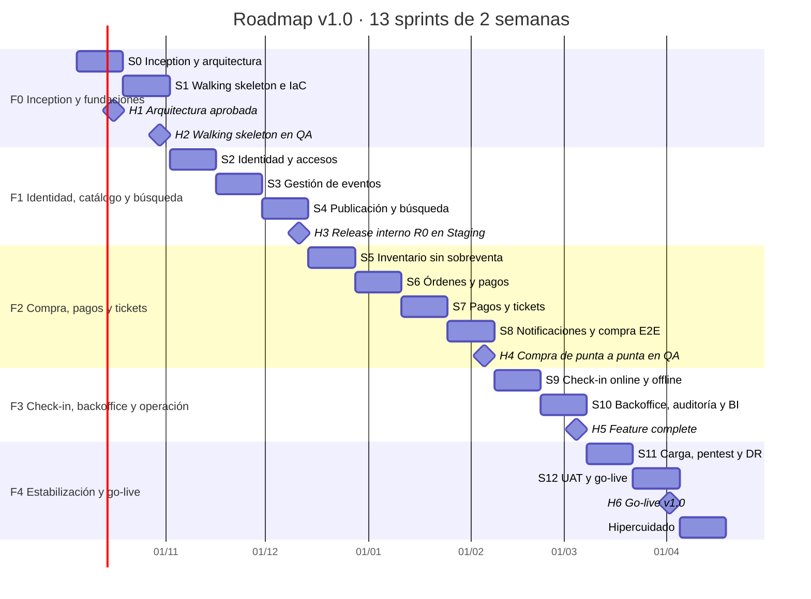

# Backlog y roadmap (v1.0 en 6 meses)

> **Entregable B del reto.** Resumen del plan. El detalle completo (101 ítems, fórmulas, Gantt, RACI y riesgos) está en el Excel: **[backlog/Backlog-Roadmap-Plataforma-Eventos.xlsx](backlog/Backlog-Roadmap-Plataforma-Eventos.xlsx)**.
> Forma de trabajo (Scrum, entornos, áreas de soporte, documentación): [proceso-desarrollo.md](proceso-desarrollo.md).

## 1. Resumen

| Parámetro | Valor |
|---|---|
| Marco | Scrum, sprints de 2 semanas |
| Duración | 13 sprints (S0–S12) = 26 semanas |
| Inicio supuesto | Lunes 5 de octubre de 2026 (editable en el Excel; las fechas se recalculan) |
| Go-live v1.0 | Viernes 2 de abril de 2027 (fin de S12) + 2 semanas de hipercuidado |
| Equipo | 12 personas: PO, SM, LT, 2 Backend, 2 Frontend, 1 FullStack, 2 QA, 1 UX, 1 UI |
| Áreas de soporte | Arquitectura, Base de Datos, Seguridad, Plataforma |
| Capacidad planificada | 460 SP (≈ 40 SP por sprint en régimen) |
| Alcance planificado v1.0 | **419 SP → 91 % de utilización** (margen para imprevistos) |
| Fuera de la v1.0 | 55 SP (promociones, marketplace, asientos numerados, integraciones con socios) |

## 2. Fases e hitos

| Hito | Fecha | Criterio |
|---|---|---|
| **H1** Arquitectura aprobada | 16/10/2026 | SAD + ADR aprobados por Arquitectura; modelo de amenazas validado por Seguridad |
| **H2** Walking skeleton en QA | 30/10/2026 | event-service → bus → notification-service desplegados por pipeline con IaC y trazas |
| **H3** Release interno R0 | 11/12/2026 | Catálogo, publicación y búsqueda en Staging |
| **H4** Compra de punta a punta | 05/02/2027 | Reserva → pago (sandbox) → ticket → notificación, automatizado en QA |
| **H5** Feature complete | 05/03/2027 | Alcance v1.0 terminado; desde aquí solo estabilización |
| **H6** Go-live v1.0 | 02/04/2027 | UAT firmado, pentest sin críticos, CAB aprobado, despliegue *blue/green* |

## 3. Plan por sprint

| Sprint | Fechas | Objetivo | Cap. | SP | Util. |
|---|---|---|---|---|---|
| S0 | 05/10 – 16/10 | Inception: visión, story map, arquitectura aprobada, cuentas AWS, plantillas y CI base | 20 | 18 | 90 % |
| S1 | 19/10 – 30/10 | Walking skeleton en DEV/QA con IaC, observabilidad y design system | 36 | 34 | 94 % |
| S2 | 02/11 – 13/11 | Identidad y accesos: Cognito, roles, login, perfiles y promotores | 40 | 37 | 93 % |
| S3 | 16/11 – 27/11 | Gestión de eventos: zonas, precios, aforos y reglas de venta | 40 | 39 | 98 % |
| S4 | 30/11 – 11/12 | Publicación con eventos de integración, OpenSearch, búsqueda y detalle | 40 | 36 | 90 % |
| S5 | 14/12 – 25/12 | Inventario sin sobreventa: holds atómicos, expiración, sala de espera | 32 | 29 | 91 % |
| S6 | 28/12 – 08/01 | Saga de compra, PSP en sandbox, webhooks y checkout | 28 | 27 | 96 % |
| S7 | 11/01 – 22/01 | Compensaciones, reembolsos, conciliación, QR firmado, Mis tickets | 40 | 36 | 90 % |
| S8 | 25/01 – 05/02 | Notificaciones multicanal, antifraude, E2E automatizado | 40 | 34 | 85 % |
| S9 | 08/02 – 19/02 | Check-in online y offline, PWA de staff, aforo en tiempo real | 40 | 37 | 93 % |
| S10 | 22/02 – 05/03 | Backoffice de soporte, auditoría, reportes, BI, alarmas y runbooks | 40 | 36 | 90 % |
| S11 | 08/03 – 19/03 | Carga de preventa, pentest, recuperación ante desastres, accesibilidad, defectos | 36 | 34 | 94 % |
| S12 | 22/03 – 02/04 | UAT, producción, datos iniciales, manuales y go-live | 28 | 22 | 79 % |
| **Total** | | | **460** | **419** | **91 %** |

La capacidad es menor en **S0** (arranque), en **S5–S6** (feriados de fin de año) y en **S11–S12** (estabilización y go-live, con holgura para defectos).

## 4. Épicas y roadmap

| Épica | SP | S0 | S1 | S2 | S3 | S4 | S5 | S6 | S7 | S8 | S9 | S10 | S11 | S12 |
|---|---|---|---|---|---|---|---|---|---|---|---|---|---|---|
| EP01 Inception y gobierno | 5 | ■ | ■ | ■ | | | | | | | | | | |
| EP02 Plataforma, CI/CD y observabilidad | 40 | ■ | ■ | ■ | ■ | ■ | ■ | ■ | ■ | ■ | ■ | ■ | | |
| EP03 Identidad y accesos | 34 | | | ■ | | | | | | | | | | |
| EP04 Gestión de eventos | 44 | | ■ | ■ | ■ | ■ | | | | | | | | |
| EP05 Búsqueda y catálogo público | 26 | | | | | ■ | | | | | | | | |
| EP06 Inventario y reservas | 26 | | | | | | ■ | | | | | | | |
| EP07 Órdenes y checkout | 26 | | | | | | | ■ | ■ | | | | | |
| EP08 Pagos | 26 | | | | | | | ■ | ■ | ■ | | | | |
| EP09 Tickets | 21 | | | | | | | | ■ | ■ | | | | |
| EP10 Notificaciones | 21 | | | | | ■ | ■ | ■ | ■ | ■ | | | | |
| EP11 Check-in | 34 | | | | | | | | | | ■ | | | |
| EP12 Backoffice, auditoría y BI | 33 | | | | | | | | | | | ■ | | |
| EP13 Calidad, seguridad y rendimiento | 61 | | ■ | ■ | ■ | ■ | ■ | ■ | ■ | ■ | ■ | ■ | ■ | |
| EP14 Salida a producción | 22 | | | | | | | | | | | | | ■ |

> Las barras indican entre qué sprints hay trabajo planificado de cada épica. En el Excel se calculan solas a partir del backlog.

## 5. Tareas principales del backlog

| Épica | Ítems principales (ver Excel para el detalle, SP y criterios de aceptación) |
|---|---|
| EP01 Inception y gobierno | Visión y KPI · story map y releases · investigación UX · SAD, C4 y ADR · modelo de amenazas · modelo de datos conceptual · design system · prototipos · *spikes* de anti-sobreventa y de PSP |
| EP02 Plataforma, CI/CD y observabilidad | Landing zone AWS · módulos Terraform · plantilla de microservicio .NET · pipeline CI · CD a DEV y QA · walking skeleton · OpenTelemetry · SLO, alarmas y runbooks |
| EP03 Identidad y accesos | Cognito con grupos · login de cliente (PKCE) · login del backoffice · autorización por rol y por recurso (anti-IDOR) · user-service · alta de promotores · Client Credentials |
| EP04 Gestión de eventos | Evento en borrador con zonas, precios y aforos · formulario del backoffice · reglas de venta · catálogos · imágenes en S3 · publicar y cancelar con outbox |
| EP05 Búsqueda y catálogo público | Proyección a OpenSearch · API de búsqueda con filtros y caché · home y resultados · detalle del evento |
| EP06 Inventario y reservas | Stock con UPDATE condicional (0 sobreventa) · holds con expiración · sala de espera virtual · selección de zona |
| EP07 Órdenes y checkout | Saga orquestada · checkout con campos alojados del PSP · compensaciones · estados de la orden |
| EP08 Pagos | Integración con el PSP e Idempotency-Key · webhooks firmados · revisión de seguridad PCI · reembolsos · conciliación · antifraude |
| EP09 Tickets | QR firmado Ed25519 · PDF · Mis órdenes y Mis tickets · Wallet (*Could*) |
| EP10 Notificaciones | Email con SES · SMS, WhatsApp y push · plantillas y reenvío · preferencias y opt-out |
| EP11 Check-in | Validación online anti doble ingreso · PWA con escaneo · modo offline con manifiesto · sincronización y conflictos · aforo en tiempo real |
| EP12 Backoffice, auditoría y BI | Backoffice de soporte · APIs auditadas · audit-service con S3 Object Lock · reportes para promotores · exportación a BI/CRM · configuración |
| EP13 Calidad, seguridad y rendimiento | Plan de pruebas y automatización · pruebas de roles e IDOR · k6 de inventario · E2E de compra · pruebas de campo del check-in · carga de preventa · pentest y remediación · DR · accesibilidad |
| EP14 Salida a producción | Producción con Terraform · UAT · datos iniciales · manuales · checklist de go-live y CAB · *blue/green* · hipercuidado |
| EP15 Evolución post v1.0 | Promociones y cupones · marketplace de reventa · asientos numerados · integraciones con socios |

**Tipos de ítem en el Excel:** Historia · Técnica · Spike · UX/UI · Documento · **Soporte** (tarea de un área de soporte de TI, con responsable y sprint, sin SP del equipo).
**Priorización:** MoSCoW. Si el burn-up muestra desvío, se recorta primero lo *Could* (Wallet) y luego lo *Should* (SMS/WhatsApp, conciliación automática, BI, imágenes con CDN) sin mover el go-live.

## 6. Dependencias con las áreas de soporte

Las solicitudes se abren **un sprint antes** de que se necesiten (ver [proceso-desarrollo.md §3](proceso-desarrollo.md#3-áreas-de-soporte-de-ti)).

| Se necesita en | Área | Solicitud |
|---|---|---|
| S0 | Arquitectura | Revisión y aprobación del SAD y de los ADR (H1) |
| S0 | Seguridad | Validación del modelo de amenazas |
| S0–S1 | Plataforma + Seguridad | Landing zone, cuentas por entorno, VPC, módulos Terraform base, firewall y WAF |
| S1 | BD | Revisión del modelo de datos conceptual; instancias Aurora para DEV y QA |
| S2 | Seguridad | Configuración de Cognito, políticas de tokens y client credentials |
| S4 | Plataforma | Dominio de SES verificado; OpenSearch en DEV y QA |
| S5 | Plataforma + Seguridad | Sala de espera virtual; reglas de WAF para preventas |
| S6 | Seguridad | Revisión del flujo de pagos (PCI, secretos, red), salida a internet hacia el PSP |
| S7 | Seguridad | Claves de firma de QR en KMS / Secrets Manager |
| S10 | Plataforma + Seguridad | Bucket de auditoría con Object Lock; Firehose hacia el data lake |
| S11 | Seguridad · Plataforma · BD | Pentest externo; prueba de DR; *tuning* de BD con carga |
| S12 | Plataforma · Seguridad · BD · Arquitectura | Entorno de producción, scripts de BD en producción, CAB, go/no-go |

## 7. Principales riesgos

| Riesgo | Nivel | Mitigación |
|---|---|---|
| Retrasos en aprobaciones y aprovisionamiento de las áreas de soporte | Alto | Solicitudes N-1, historias habilitadoras, sincronización semanal, Terraform de autoservicio |
| Integración o certificación del PSP más lenta de lo previsto | Alto | Spike en S0, sandbox temprano, PSP alternativo identificado |
| Volúmenes de preventa mayores a lo estimado | Alto | Sala de espera, pruebas de carga desde S5, autoescalado, contadores particionados |
| Hallazgos críticos de seguridad cerca del go-live | Alto | SAST/DAST continuos, revisiones por épica, pentest en S11 con tiempo para remediar |
| Alcance mayor a la capacidad | Medio | MoSCoW, recortes predefinidos, burn-up quincenal con el PO |
| Menor capacidad en diciembre y enero | Medio | Capacidad reducida en S5–S6, vacaciones escalonadas |

Registro completo (11 riesgos con probabilidad, impacto y responsable) en la hoja **Riesgos** del Excel.

## 8. Contenido del Excel

| Hoja | Contenido |
|---|---|
| **Resumen** | Parámetros editables (fecha de inicio, duración del sprint), totales, supuestos, equipo, leyenda |
| **Backlog** | 101 ítems: ID, épica, ítem, tipo, prioridad MoSCoW, SP, sprint, responsable, área de soporte, criterio de aceptación, estado. Con filtros y listas desplegables |
| **Sprints** | Fechas calculadas, fase, objetivo, capacidad (editable), SP planificados, % de utilización con semáforo, hitos |
| **Roadmap** | Gantt por épica calculado desde el backlog, fases, hitos, carga vs. capacidad |
| **RACI** | Equipo Scrum + áreas de soporte en 20 actividades |
| **Documentos** | Documentación técnica y funcional: responsable, aprobador y momento |
| **Riesgos** | Probabilidad × impacto con nivel calculado y mitigación |
