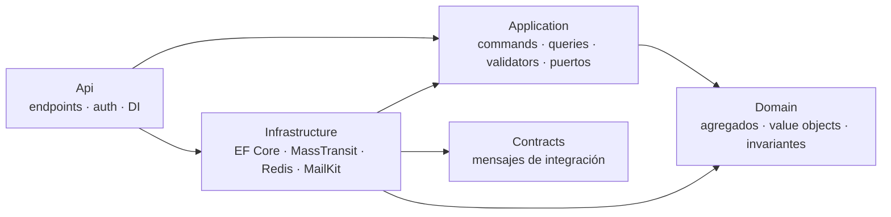
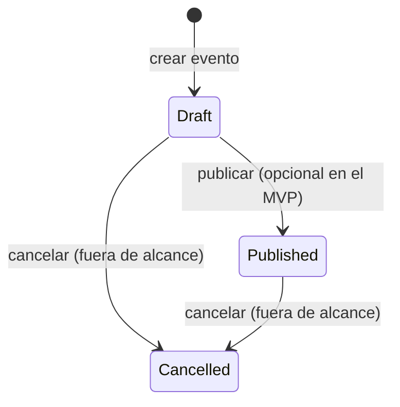
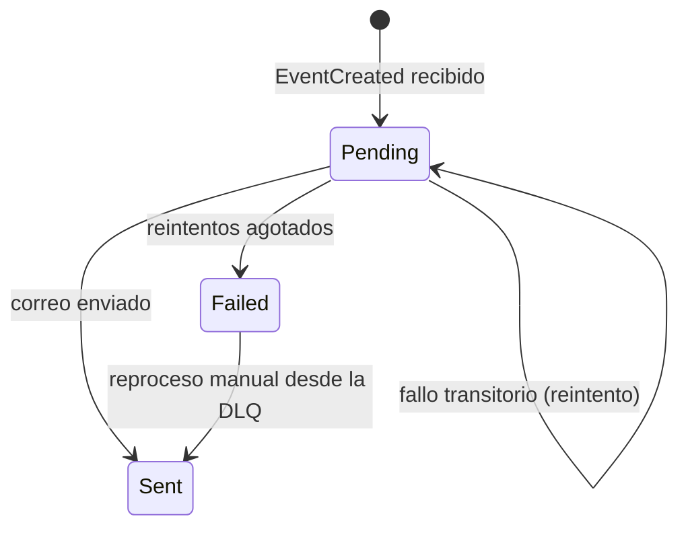
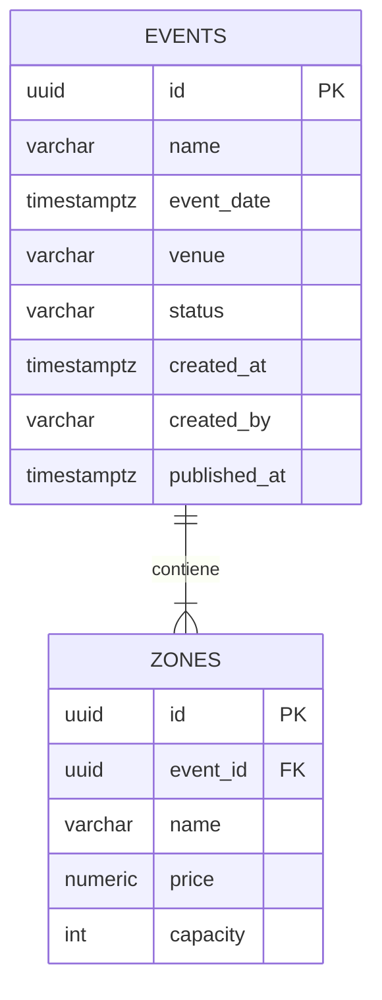

# Especificación técnica del MVP

> Guía de construcción del MVP del reto: **2 APIs .NET** comunicadas de forma asíncrona por **RabbitMQ**, persistencia en **PostgreSQL**, caché **Redis** y una **pantalla React** para registrar eventos.
> Contexto de arquitectura: [../architecture.md](../architecture.md) (§15) · Decisiones: [../decisiones-arquitectura.md](../decisiones-arquitectura.md) · Plan de 2 días: [plan-de-ejecucion.md](plan-de-ejecucion.md).

## Índice
1. [Alcance](#1-alcance)
2. [Stack y versiones](#2-stack-y-versiones)
3. [Estructura de la solución](#3-estructura-de-la-solución)
4. [EventService: dominio](#4-eventservice-dominio)
5. [EventService: API](#5-eventservice-api)
6. [Caché con Redis](#6-caché-con-redis)
7. [Mensajería](#7-mensajería)
8. [NotificationService](#8-notificationservice)
9. [Persistencia](#9-persistencia)
10. [Seguridad](#10-seguridad)
11. [Observabilidad](#11-observabilidad)
12. [Frontend: pantalla “Registrar Evento”](#12-frontend-pantalla-registrar-evento)
13. [Infraestructura local](#13-infraestructura-local)
14. [Estrategia de pruebas](#14-estrategia-de-pruebas)
15. [Definition of Done del MVP](#15-definition-of-done-del-mvp)
16. [Guion de demostración](#16-guion-de-demostración)

---

## 1. Alcance

| Incluido | Prioridad |
|---|---|
| `POST /events`: crea el evento y sus zonas en una transacción y publica `EventCreated` (outbox) | **Obligatorio** |
| `GET /events`: listado paginado con caché en Redis | **Obligatorio** |
| NotificationService: consume `EventCreated`, persiste el registro (idempotente) y envía el correo con MailKit | **Obligatorio** |
| Reintentos y cola de error (DLQ), con estado `Failed` | **Obligatorio / bonus fuerte** |
| Scripts o migraciones de BD, Dockerfiles, `docker-compose.yml` y README | **Obligatorio** |
| Pantalla React “Registrar Evento” con validación y estados de carga y error | **Obligatorio** |
| `GET /events/{id}` (detalle) | Opcional (incluido) |
| JWT + roles (`Admin`, `User`), errores seguros, rate limiting, logs sin datos sensibles | Bonus (incluido) |
| `POST /events/{id}/publish` → `EventPublished` | Opcional: solo si sobra tiempo |
| Jaeger (trazas), Keycloak, `Idempotency-Key` en `POST /events` | Opcional: solo si sobra tiempo |

**Fuera de alcance:** inventario, órdenes, pagos, tickets, check-in, búsqueda avanzada, edición o cancelación de eventos y despliegue en AWS (solo se documenta).

---

## 2. Stack y versiones

| Capa | Tecnología | Nota |
|---|---|---|
| Runtime | **.NET 10 (LTS)**, C# 14 | Si hay restricciones, .NET 9 también cumple el reto |
| API | ASP.NET Core Minimal APIs + OpenAPI nativo; Scalar UI en EventService | `/openapi/v1.json`; `/scalar/v1` en EventService (solo Development) |
| ORM | EF Core 10 + `Npgsql.EntityFrameworkCore.PostgreSQL` | Migraciones como fuente de verdad del esquema |
| Mensajería | **MassTransit 8.x** + RabbitMQ | Outbox de EF Core, reintentos, cola de error. v8 con licencia Apache 2.0 (ADR-011) |
| Casos de uso | Servicios de aplicación explícitos + FluentValidation | Menos infraestructura accidental para el alcance del MVP; handlers simples y testeables |
| Mapeo | Manual (métodos de extensión) | Sin AutoMapper (ADR-011) |
| Caché | StackExchange.Redis | Cache-aside con invalidación por versión |
| Resiliencia | Reintentos de MassTransit + timeout de SMTP | Intervalos de 1 s, 5 s y 15 s; cola `_error` al agotarse |
| Correo | **MailKit** | SMTP hacia Mailpit en local |
| Logs / trazas | Logs estructurados + correlación del mensaje | OpenTelemetry/Jaeger queda como mejora opcional |
| Pruebas | xUnit, Shouldly, NSubstitute, Vitest y Testing Library | Testcontainers y Test Harness quedan pendientes |
| BD | **PostgreSQL 17** | Una base por servicio: `events_db`, `notifications_db` |
| Broker | **RabbitMQ 4** (con consola de administración) | |
| Caché | **Redis 7** | |
| SMTP de pruebas | **Mailpit** | Interfaz web para ver los correos |
| Frontend | **React 19 + TypeScript + Vite**, Tailwind CSS 4, React Hook Form + Zod | Vitest + Testing Library |
| Contenedores | Docker Desktop / Podman + Compose | |

---

## 3. Estructura de la solución

```text
.
├── Metrica.slnx
├── Directory.Build.props            # net10.0, Nullable, TreatWarningsAsErrors, analizadores
├── docker-compose.yml
├── .env.example                     # Variables de entorno (sin secretos reales)
├── db/
│   ├── init.sql                     # Roles y bases events_db / notifications_db
│   └── scripts/                     # Scripts idempotentes generados desde las migraciones EF
│       ├── events_db.sql
│       └── notifications_db.sql
├── src/
│   ├── BuildingBlocks/
│   │   └── Contracts/               # Mensajes de integración (records), sin lógica
│   ├── EventService/
│   │   ├── EventService.Domain/
│   │   ├── EventService.Application/
│   │   ├── EventService.Infrastructure/
│   │   ├── EventService.Api/
│   │   └── Dockerfile
│   └── NotificationService/
│       ├── NotificationService.Domain/
│       ├── NotificationService.Application/
│       ├── NotificationService.Infrastructure/
│       ├── NotificationService.Api/
│       └── Dockerfile
├── tests/
│   ├── EventService.UnitTests/
│   ├── EventService.IntegrationTests/
│   ├── NotificationService.UnitTests/
│   └── NotificationService.IntegrationTests/
├── frontend/
│   └── web-admin/                   # React + Vite + TS
└── docs/
```

### 3.1 Reglas de dependencia (arquitectura limpia)



| Capa | Contiene | No puede depender de |
|---|---|---|
| **Domain** | `Event` (raíz de agregado), `Zone`, *value objects*, `EventStatus`, `DomainException` | Nada (ni EF, ni MassTransit, ni ASP.NET) |
| **Application** | `CreateEventCommand` y su *handler*, `GetEventsQuery`, `GetEventByIdQuery`, validadores, DTOs, puertos (`IEventRepository`, `IUnitOfWork`, `IEventsCache`, `IIntegrationEventPublisher`) | Infrastructure, Api |
| **Infrastructure** | `EventsDbContext`, configuraciones y migraciones EF, repositorios, adaptador de MassTransit, caché Redis, `TimeProvider` | Api |
| **Api** | Endpoints, autenticación y autorización, manejo seguro de errores, rate limiting, health checks y *composition root* | — |

> Se recomienda un proyecto de pruebas de arquitectura (NetArchTest o ArchUnitNET) que falle si Domain referencia a EF Core o si Application referencia a Infrastructure.

---

## 4. EventService: dominio

### 4.1 Modelo

| Elemento | Tipo DDD | Atributos | Invariantes |
|---|---|---|---|
| `Event` | Raíz de agregado | `Id` (UUID v7), `Name`, `Date`, `Venue`, `Status`, `Zones`, `CreatedAt`, `CreatedBy`, `PublishedAt`, `Version` (concurrencia) | Nombre de 3 a 150 caracteres · fecha futura · lugar de 3 a 200 caracteres · **al menos 1 zona** · **nombres de zona únicos** (sin distinguir mayúsculas) · máximo 20 zonas |
| `Zone` | Entidad (dentro del agregado) | `Id`, `EventId`, `Name`, `Price`, `Capacity` | Nombre de 1 a 100 caracteres · `Price >= 0` con 2 decimales como máximo · `Capacity > 0` (máximo 100.000) |
| `EventStatus` | Enumeración | `Draft`, `Published`, `Cancelled` | Transiciones válidas (abajo) |

> La **moneda** se asume única y configurada en el MVP; en la arquitectura objetivo `Price` pasa a ser un *value object* `Money(amount, currency)`.



### 4.2 Esqueleto de referencia

```csharp
public sealed class Event
{
    private readonly List<Zone> _zones = [];

    public Guid Id { get; private set; }
    public string Name { get; private set; } = default!;
    public DateTimeOffset Date { get; private set; }
    public string Venue { get; private set; } = default!;
    public EventStatus Status { get; private set; }
    public DateTimeOffset CreatedAt { get; private set; }
    public string CreatedBy { get; private set; } = default!;
    public DateTimeOffset? PublishedAt { get; private set; }
    public IReadOnlyCollection<Zone> Zones => _zones.AsReadOnly();

    private Event() { } // EF Core

    public static Event Create(string name, DateTimeOffset date, string venue,
        IReadOnlyCollection<NewZone> zones, string createdBy, TimeProvider clock)
    {
        var now = clock.GetUtcNow();
        if (date <= now) throw new DomainException("event.date_in_past", "La fecha del evento debe ser futura.");
        if (zones.Count == 0) throw new DomainException("event.zones_required", "El evento debe tener al menos una zona.");
        if (zones.GroupBy(z => z.Name.Trim(), StringComparer.OrdinalIgnoreCase).Any(g => g.Count() > 1))
            throw new DomainException("event.zone_duplicated", "Los nombres de zona deben ser únicos.");

        var evt = new Event
        {
            Id = Guid.CreateVersion7(), Name = name.Trim(), Date = date.ToUniversalTime(),
            Venue = venue.Trim(), Status = EventStatus.Draft, CreatedAt = now, CreatedBy = createdBy
        };
        evt._zones.AddRange(zones.Select(z => Zone.Create(evt.Id, z.Name, z.Price, z.Capacity)));
        return evt;
    }

    public void Publish(TimeProvider clock)
    {
        if (Status != EventStatus.Draft)
            throw new DomainException("event.invalid_transition", "Solo se puede publicar un evento en borrador.");
        Status = EventStatus.Published;
        PublishedAt = clock.GetUtcNow();
    }
}
```

**Caso de uso `CreateEventCommandHandler`** (Application):
1. El validador (FluentValidation) rechaza el formato con **400**.
2. `Event.Create(...)` aplica las invariantes del dominio; si falla, lanza `DomainException` → **422**.
3. `repository.Add(evt)`.
4. `integrationEventPublisher.Publish(EventCreated.From(evt, correlationId))`: con el outbox **no se envía todavía**, queda registrado en el `DbContext`.
5. `unitOfWork.SaveChangesAsync()` guarda el **evento, las zonas y el mensaje del outbox en una sola transacción**.
6. `eventsCache.InvalidateListAsync()` (a partir de aquí, un error se registra en el log y no se propaga).
7. Devuelve `EventDto` → **201**.

---

## 5. EventService: API

Base local: `http://localhost:5001`. Todas las respuestas de error usan **`application/problem+json`** (RFC 9457).

| Método | Ruta | Rol | Descripción | Respuestas |
|---|---|---|---|---|
| `POST` | `/events` | `Admin` | Crea el evento y sus zonas y publica `EventCreated` | 201, 400, 401, 403, 422, 429, 500 |
| `GET` | `/events` | `Admin`, `User` | Listado paginado (con caché) | 200, 400, 401, 429 |
| `GET` | `/events/{id}` | `Admin`, `User` | Detalle con zonas (opcional) | 200, 401, 404 |
| `POST` | `/events/{id}/publish` | `Admin` | Publica el evento → `EventPublished` (opcional) | 204, 401, 403, 404, 409 |
| `POST` | `/auth/dev-token` | Anónimo, **solo `Development`** | Emite un JWT de prueba para un rol | 200, 400 |
| `GET` | `/health/live`, `/health/ready` | Anónimo | *Liveness* y *readiness* (BD, RabbitMQ, Redis) | 200, 503 |

**Cabeceras**

| Cabecera | Dirección | Uso |
|---|---|---|
| `Authorization: Bearer <jwt>` | Petición | Obligatoria salvo en health y dev-token |
| `X-Correlation-Id` | Petición y respuesta | Si no llega, se genera. Se propaga al mensaje y a los logs |
| `X-Cache: HIT \| MISS` | Respuesta de `GET /events` | Demuestra el uso de la caché |
| `Location` | Respuesta 201 | `/events/{id}` |
| `Retry-After` | Respuesta 429 | Segundos de espera |

### 5.1 `POST /events`

```http
POST /events
Authorization: Bearer eyJhbGciOi...
Content-Type: application/json
X-Correlation-Id: 5f0c7a3e-2b1d-4f9a-9d7e-1c2b3a4d5e6f

{
  "name": "Concierto Sinfónico de Verano",
  "date": "2026-12-15T20:00:00-05:00",
  "venue": "Gran Teatro Nacional",
  "zones": [
    { "name": "VIP",      "price": 350.00, "capacity": 200 },
    { "name": "Platea",   "price": 180.00, "capacity": 800 },
    { "name": "General",  "price": 90.00,  "capacity": 1500 }
  ]
}
```

```http
HTTP/1.1 201 Created
Location: /events/0192f4a0-6c1e-7b3a-9f2d-2a6c5e8b1d40

{
  "id": "0192f4a0-6c1e-7b3a-9f2d-2a6c5e8b1d40",
  "name": "Concierto Sinfónico de Verano",
  "date": "2026-12-16T01:00:00+00:00",
  "venue": "Gran Teatro Nacional",
  "status": "Draft",
  "createdAt": "2026-09-26T15:04:05+00:00",
  "zones": [
    { "id": "0192f4a0-6c1e-7b3a-9f2d-2a6c5e8b1d41", "name": "VIP", "price": 350.00, "capacity": 200 }
  ]
}
```

**Reglas de validación** (el frontend aplica las mismas reglas):

| Campo | Regla | Mensaje |
|---|---|---|
| `name` | Obligatorio, 3–150 caracteres | “El nombre es obligatorio (3 a 150 caracteres).” |
| `date` | Obligatoria, ISO-8601 con zona horaria, futura | “La fecha debe ser futura.” |
| `venue` | Obligatorio, 3–200 caracteres | “El lugar es obligatorio.” |
| `zones` | 1–20 elementos, nombres únicos | “Agrega al menos una zona.” / “Zona duplicada.” |
| `zones[i].name` | Obligatorio, 1–100 caracteres | “El nombre de la zona es obligatorio.” |
| `zones[i].price` | `>= 0`, 2 decimales como máximo | “El precio debe ser mayor o igual a 0.” |
| `zones[i].capacity` | Entero `> 0`, `<= 100000` | “La capacidad debe ser mayor a 0.” |

**Error de validación (400):**
```json
{
  "type": "https://httpstatuses.io/400",
  "title": "Uno o más campos no son válidos.",
  "status": 400,
  "errors": {
    "zones[1].capacity": ["La capacidad debe ser mayor a 0."]
  },
  "traceId": "00-4bf92f3577b34da6a3ce929d0e0e4736-00f067aa0ba902b7-01"
}
```

**Error inesperado (500):** solo `title` genérico, `status` y `traceId`. **Nunca** incluye *stack trace*, SQL ni nombres de tablas.

### 5.2 `GET /events`

Parámetros: `page` (≥ 1, por defecto 1), `pageSize` (1–50, por defecto 20), `status` (opcional), `from` (fecha opcional). Un usuario con rol **`User`** solo ve eventos `Published`; `Admin` ve todos y puede filtrar por `status`.

```json
{
  "items": [
    {
      "id": "0192f4a0-6c1e-7b3a-9f2d-2a6c5e8b1d40",
      "name": "Concierto Sinfónico de Verano",
      "date": "2026-12-16T01:00:00+00:00",
      "venue": "Gran Teatro Nacional",
      "status": "Draft",
      "zonesCount": 3,
      "minPrice": 90.00,
      "totalCapacity": 2500
    }
  ],
  "page": 1,
  "pageSize": 20,
  "totalCount": 1
}
```

---

## 6. Caché con Redis

| Aspecto | Decisión |
|---|---|
| Patrón | **Cache-aside** en el *handler* de `GetEventsQuery` (y en el detalle, si se implementa) |
| Clave del listado | `events:list:v{version}:{role}:{status}:{from}:{page}:{pageSize}` |
| Invalidación | `INCR events:list:version` después de un `POST` o un *publish* exitoso. Las claves anteriores quedan huérfanas y expiran por TTL (sin `SCAN` ni `KEYS`) |
| TTL | 60 s + *jitter* aleatorio de 0 a 10 s (evita expiraciones simultáneas) |
| Clave del detalle | `events:detail:{id}`, TTL de 5 min, se borra al publicar |
| Serialización | JSON (`System.Text.Json`) |
| Fallo de Redis | **Degradación controlada:** *timeout* corto (≈200 ms), `abortConnect=false`, log de advertencia y consulta a la base. La API **no falla** porque Redis esté caído |
| Observabilidad | Cabecera `X-Cache` y métricas `cache_hits` / `cache_misses` |

> Límite aceptado: si el `INCR` falla después del *commit*, el listado puede quedar desactualizado durante un TTL como máximo (60 s).

---

## 7. Mensajería

### 7.1 Contrato `EventCreated` v1

Incluye el **mínimo exigido por el reto** más el estado necesario para el correo (ADR-012). No lleva PII.

```json
{
  "messageId": "0192f4a0-6c20-7c11-8d55-0e2f6b7a9c10",
  "eventId": "0192f4a0-6c1e-7b3a-9f2d-2a6c5e8b1d40",
  "name": "Concierto Sinfónico de Verano",
  "occurredAt": "2026-09-26T15:04:05.123Z",
  "correlationId": "5f0c7a3e-2b1d-4f9a-9d7e-1c2b3a4d5e6f",
  "version": 1,
  "date": "2026-12-16T01:00:00Z",
  "venue": "Gran Teatro Nacional",
  "status": "Draft",
  "zones": [
    { "name": "VIP", "price": 350.00, "capacity": 200 },
    { "name": "Platea", "price": 180.00, "capacity": 800 },
    { "name": "General", "price": 90.00, "capacity": 1500 }
  ]
}
```

```csharp
namespace Contracts.Events;

[EntityName("event-created.v1")]          // exchange en RabbitMQ / tópico en SNS
[MessageUrn("event-created:v1")]
public sealed record EventCreated(
    Guid MessageId, Guid EventId, string Name, DateTimeOffset OccurredAt,
    Guid CorrelationId, int Version, DateTimeOffset Date, string Venue,
    string Status, IReadOnlyList<EventCreatedZone> Zones);

public sealed record EventCreatedZone(string Name, decimal Price, int Capacity);
```

Al publicar, el **sobre** de MassTransit reutiliza los identificadores del contrato:
```csharp
await publishEndpoint.Publish(message, ctx =>
{
    ctx.MessageId = message.MessageId;          // misma clave de idempotencia en sobre y payload
    ctx.CorrelationId = message.CorrelationId;
}, ct);
```

### 7.2 Topología en RabbitMQ

| Elemento | Nombre | Notas |
|---|---|---|
| Exchange (fanout) | `event-created.v1` | Creado por MassTransit a partir de `[EntityName]` |
| Cola del consumidor | `notifications-event-created` | Enlazada al exchange. Una cola por servicio consumidor |
| Cola de error (DLQ) | `notifications-event-created_error` | Mensajes que agotaron los reintentos (MassTransit agrega cabeceras con la excepción) |
| Mensajes omitidos | `notifications-event-created_skipped` | Mensajes sin consumidor que los maneje |

### 7.3 Outbox en EventService

```csharp
services.AddMassTransit(x =>
{
    x.AddEntityFrameworkOutbox<EventsDbContext>(o =>
    {
        o.UsePostgres();
        o.UseBusOutbox();                       // Publish() escribe en outbox_message dentro de la TX del DbContext
        o.QueryDelay = TimeSpan.FromSeconds(1);
    });
    x.UsingRabbitMq((ctx, cfg) =>
    {
        cfg.Host(rabbit.Host, rabbit.VirtualHost, h => { h.Username(rabbit.User); h.Password(rabbit.Password); });
        cfg.ConfigureEndpoints(ctx);
    });
});
// En EventsDbContext.OnModelCreating:
modelBuilder.AddInboxStateEntity();
modelBuilder.AddOutboxMessageEntity();
modelBuilder.AddOutboxStateEntity();
```

**Verificación:** si RabbitMQ está detenido, `POST /events` **sigue respondiendo 201**, el mensaje queda en `outbox_message` y se publica cuando el broker vuelve.

---

## 8. NotificationService

### 8.1 Responsabilidades
1. Consumir `EventCreated` (y `EventPublished`, si se implementa).
2. Persistir el registro de la notificación (`eventId`, `name`, `occurredAt`, `correlationId`, `payloadHash`) en **su propia base** (`notifications_db`).
3. Enviar un correo con el detalle del evento usando **MailKit**.
4. Garantizar **idempotencia**, **reintentos** y **DLQ**.
5. Exponer `GET /notifications?eventId=` (rol `Admin`) para inspección, y los health checks.

### 8.2 Algoritmo del consumidor

```text
Consume(EventCreated msg):
  hash = SHA-256(JSON canónico del mensaje)
  n = repo.GetByMessageId(msg.MessageId)

  si n existe y n.Status == Sent:
      log "mensaje duplicado ignorado" (messageId, correlationId) → ack y fin
  si n existe y n.PayloadHash != hash:
      log advertencia "mismo messageId con contenido distinto" → no reprocesar, ack y fin

  si n no existe:
      n = Notification.Create(msg, hash)           // Status = Pending
      guardar → si viola el índice único (carrera entre réplicas): recargar n

  intentar:
      emailSender.Send(plantilla(msg), timeout 10 s)
      n.MarkSent(now) → guardar → ack
  si falla:
      n.RegisterFailedAttempt(error resumido) → guardar
      relanzar → MassTransit reintenta (1 s, 5 s, 15 s)

Consume(Fault<EventCreated>):                      // reintentos agotados → el mensaje ya está en _error
  n.MarkFailed() → guardar → log error + métrica notifications_failed_total
```



### 8.3 Configuración de reintentos y DLQ

```csharp
public sealed class EventCreatedConsumerDefinition : ConsumerDefinition<EventCreatedConsumer>
{
    public EventCreatedConsumerDefinition() => EndpointName = "notifications-event-created";

    protected override void ConfigureConsumer(IReceiveEndpointConfigurator endpoint,
        IConsumerConfigurator<EventCreatedConsumer> consumer, IRegistrationContext context)
    {
        endpoint.UseMessageRetry(r =>
        {
            r.Intervals(TimeSpan.FromSeconds(1), TimeSpan.FromSeconds(5), TimeSpan.FromSeconds(15));
            r.Ignore<ValidationException>();   // no transitorio → directo a _error
        });
    }
}
```

| Escenario | Comportamiento esperado |
|---|---|
| Mensaje nuevo, SMTP disponible | 1 registro `Sent`, 1 correo |
| Mismo `messageId` reenviado | Sin registro nuevo, sin correo, log “duplicado” |
| SMTP falla una vez | `attempts = 2`, estado final `Sent` |
| SMTP caído de forma permanente | 3 reintentos → mensaje en `notifications-event-created_error`, estado `Failed` |
| Reproceso desde la DLQ (plugin *shovel*) | El registro `Failed` pasa a `Sent` sin duplicar filas |

### 8.4 Correo
- **Para:** una lista configurada (`Notifications__Email__To`). En el MVP no se envía el email del creador en el mensaje, para no mover PII por el broker.
- **Asunto:** `Nuevo evento registrado: {name}`.
- **Cuerpo (HTML + texto):** nombre, fecha en la zona horaria configurada, lugar, estado, tabla de zonas (nombre, precio, capacidad) y `correlationId` en el pie para soporte.

---

## 9. Persistencia

**Estrategia:** una sola instancia de PostgreSQL con **una base por servicio** y **un usuario por servicio** con permisos solo sobre su base (*DB per service*, recomendado por el reto).

- `db/init.sql` crea los roles y las bases.
- Cada API aplica sus **migraciones EF** al arrancar **solo si** `Database__ApplyMigrationsOnStartup=true` (activo en docker-compose).
- En QA, Staging y Producción, las migraciones se aplican desde el pipeline con los scripts idempotentes de `db/scripts/`, revisados por el área de BD.

### 9.1 `events_db`



```sql
CREATE TABLE events (
    id            uuid          PRIMARY KEY,
    name          varchar(150)  NOT NULL,
    event_date    timestamptz   NOT NULL,
    venue         varchar(200)  NOT NULL,
    status        varchar(20)   NOT NULL CHECK (status IN ('Draft','Published','Cancelled')),
    created_at    timestamptz   NOT NULL DEFAULT now(),
    created_by    varchar(100)  NOT NULL,
    published_at  timestamptz   NULL
    -- concurrencia optimista: columna de sistema xmin (EF: IsRowVersion)
);
CREATE INDEX ix_events_status_date ON events (status, event_date);

CREATE TABLE zones (
    id        uuid           PRIMARY KEY,
    event_id  uuid           NOT NULL REFERENCES events(id) ON DELETE CASCADE,
    name      varchar(100)   NOT NULL,
    price     numeric(12,2)  NOT NULL CHECK (price >= 0),
    capacity  integer        NOT NULL CHECK (capacity > 0),
    CONSTRAINT uq_zones_event_name UNIQUE (event_id, name)
);
-- Tablas de MassTransit (creadas por la migración): outbox_message, outbox_state, inbox_state
```

### 9.2 `notifications_db`

```sql
CREATE TABLE notifications (
    id              uuid           PRIMARY KEY,
    message_id      uuid           NOT NULL,
    message_type    varchar(100)   NOT NULL,           -- 'EventCreated'
    event_id        uuid           NOT NULL,
    event_name      varchar(150)   NOT NULL,
    occurred_at     timestamptz    NOT NULL,
    correlation_id  uuid           NOT NULL,
    payload_hash    char(64)       NOT NULL,           -- SHA-256 en hexadecimal
    payload         jsonb          NOT NULL,           -- sin PII
    channel         varchar(20)    NOT NULL DEFAULT 'Email',
    status          varchar(20)    NOT NULL CHECK (status IN ('Pending','Sent','Failed')),
    attempts        integer        NOT NULL DEFAULT 0,
    last_error      varchar(1000)  NULL,               -- mensaje resumido, sin stack trace
    received_at     timestamptz    NOT NULL DEFAULT now(),
    sent_at         timestamptz    NULL,
    CONSTRAINT uq_notifications_message_id UNIQUE (message_id)   -- idempotencia
);
CREATE INDEX ix_notifications_event_id ON notifications (event_id);
CREATE INDEX ix_notifications_status   ON notifications (status) WHERE status <> 'Sent';
```

### 9.3 Migraciones y datos iniciales

```bash
# Crear una migración (desde la raíz del repo)
dotnet ef migrations add InitialCreate \
  -p src/EventService/EventService.Infrastructure -s src/EventService/EventService.Api -o Persistence/Migrations

# Aplicar contra la base local
dotnet ef database update -p src/EventService/EventService.Infrastructure -s src/EventService/EventService.Api

# Generar el script idempotente para QA, Staging y Producción (revisión del área de BD)
dotnet ef migrations script --idempotent \
  -p src/EventService/EventService.Infrastructure -s src/EventService/EventService.Api -o db/scripts/events_db.sql
```

**Datos iniciales:** no se cargan eventos automáticamente. Las bases y usuarios se crean con `db/init.sql`; las tablas se crean con migraciones EF. Los eventos de demostración se registran desde el frontend o la API.

---

## 10. Seguridad

| Requisito | Implementación en el MVP |
|---|---|
| **JWT** | `AddAuthentication().AddJwtBearer()`. Valida `iss` (`events-platform-local`), `aud` (`events-api`), `exp`, firma HS256 y `ClockSkew` de 30 s. Clave en `Jwt__SigningKey` (≥ 32 bytes, desde `.env`). Tokens de 60 min |
| Emisión de tokens de prueba | `POST /auth/dev-token { "role": "Admin" \| "User" }`, registrado **solo si** `IsDevelopment()`. Claims: `sub`, `name`, `role`, `jti` |
| **Roles** | Políticas `CanManageEvents` (`Admin`) y `CanReadEvents` (`Admin`, `User`) |
| **IDOR** | No hay endpoints “míos” en el MVP. La regla queda en la guía: cualquier recurso por usuario se filtra por el `sub` del token y nunca por un id del cliente |
| **Errores seguros** | `AddProblemDetails()` + `IExceptionHandler` propio: validación → 400, `DomainException` → 422, no encontrado → 404, conflicto → 409, cualquier otra → 500 genérico con `traceId`. `DbUpdateException` y `NpgsqlException` nunca salen al cliente |
| **Anti-abuso** | Middleware `RateLimiter` de ASP.NET Core: política `writes` (ventana fija, 10 peticiones/min por `sub`) en `POST`; política `reads` (100 peticiones/min por IP) en `GET`. Responde 429 con `Retry-After` |
| **Logs sin datos sensibles** | No se registran la cabecera `Authorization`, cuerpos de petición, contraseñas ni tokens. Los emails se enmascaran (`j***@dominio.com`). Serilog con filtro de propiedades sensibles |
| CORS | Solo el origen del frontend (`Cors__AllowedOrigins`) |
| Secretos | Solo en `.env` (fuera de git) y `.env.example` con valores ficticios. En AWS, Secrets Manager |
| Contenedores | Imágenes *multi-stage*, usuario no root (`USER app`), sin SDK en la imagen final |

---

## 11. Observabilidad

| Señal | Implementación |
|---|---|
| Logs | Ambas APIs escriben JSON con Serilog y propiedades estructuradas; no se registran cuerpos, tokens ni credenciales |
| Correlación | EventService lee o genera `X-Correlation-Id`, lo devuelve y lo incluye en `EventCreated`; NotificationService lo agrega al alcance de logs del consumidor y maneja la cabecera en HTTP |
| Trazas | OpenTelemetry y exportación OTLP a Jaeger quedan como mejora opcional |
| Métricas | Las métricas propias quedan como mejora opcional; el MVP expone logs y health checks |
| Health | Ambas APIs exponen `/health/live` y `/health/ready`; EventService comprueba PostgreSQL y NotificationService comprueba PostgreSQL y SMTP |

---

## 12. Frontend: pantalla “Registrar Evento”

### 12.1 Comportamiento

| Elemento | Especificación |
|---|---|
| Sesión de demo | Selector “Rol de demo: Admin / User” que llama a `POST /auth/dev-token` y guarda el token **en memoria**. Alternativa: `VITE_DEMO_TOKEN` fijo |
| Formulario | Nombre, Fecha y hora (`datetime-local` → ISO-8601 con la zona del navegador), Lugar, Zonas (lista editable: agregar y quitar filas con nombre, precio y capacidad). Empieza con 1 zona vacía |
| Validación | Zod + React Hook Form (`useFieldArray`), con las mismas reglas de §5.1. Errores bajo cada campo y `aria-invalid` |
| Guardar | Botón deshabilitado y con *spinner* mientras envía; evita el doble envío |
| Éxito (201) | Alerta de éxito con el id del evento; se limpia el formulario |
| 400 | Los `errors` del ProblemDetails se asignan a los campos (`zones[1].capacity` → fila 2) |
| 401 / 403 | “Tu sesión expiró” / “No tienes permisos para registrar eventos (rol requerido: Admin)” |
| 429 | “Demasiadas solicitudes, intenta en N segundos” |
| 5xx / red | Mensaje genérico con `traceId` para soporte, sin detalles técnicos |
| Accesibilidad | `label` en cada campo, foco en el primer error, contraste AA, navegable con teclado |

### 12.2 Estructura

```text
frontend/web-admin/
├── src/
│   ├── api/
│   │   ├── httpClient.ts          # fetch + Bearer + X-Correlation-Id + parseo de ProblemDetails
│   │   └── eventsApi.ts           # createEvent(), getEvents()
│   ├── auth/
│   │   └── DemoAuthProvider.tsx   # token en memoria, selector de rol
│   ├── features/events/
│   │   ├── CreateEventPage.tsx
│   │   ├── ZonesFieldArray.tsx
│   │   └── eventSchema.ts         # esquema Zod (reglas de §5.1)
│   ├── components/ui/             # Button, Input, Alert, Spinner
│   ├── App.tsx
│   └── main.tsx
├── .env.example                   # VITE_API_BASE_URL=http://localhost:5001
├── Dockerfile                     # node:22 build → nginx:alpine
└── package.json
```

> Las variables `VITE_*` se resuelven al **compilar**. En Docker se pasan como `build.args` en docker-compose.

---

## 13. Infraestructura local

### 13.1 Servicios de `docker-compose.yml`

| Servicio | Imagen | Puertos host | Depende de (`service_healthy`) |
|---|---|---|---|
| `db` | `postgres:17-alpine` (monta `db/init.sql` en `/docker-entrypoint-initdb.d`) | 5432 | — |
| `rabbitmq` | `rabbitmq:4-management` | 5672, 15672 | — |
| `redis` | `redis:7-alpine` | 6379 | — |
| `mailpit` | `axllent/mailpit` | 1025 (SMTP), 8025 (UI) | — |
| `api-event` | build `src/EventService/Dockerfile` (contexto: raíz del repo) | 5001 → 8080 | db, rabbitmq, redis |
| `api-notifications` | build `src/NotificationService/Dockerfile` (contexto: raíz del repo) | 5002 → 8080 | db, rabbitmq, mailpit |
| `web` | build `frontend/web-admin/Dockerfile` | 3000 → 80 | api-event |
| `jaeger` *(perfil `observability`)* | `jaegertracing/jaeger` | 16686, 4317 | — |

### 13.2 URLs locales

| Recurso | URL |
|---|---|
| Frontend | http://localhost:3000 |
| api-event (Scalar UI) | http://localhost:5001/scalar/v1 |
| api-notifications | http://localhost:5002/scalar/v1 |
| RabbitMQ Management | http://localhost:15672 |
| Mailpit (correos) | http://localhost:8025 |

### 13.3 Variables de entorno (`.env.example`)

| Variable | Servicio | Ejemplo |
|---|---|---|
| `POSTGRES_PASSWORD` | db | `change-me` |
| `ConnectionStrings__EventsDb` | api-event | `Host=db;Database=events_db;Username=events_app;Password=...` |
| `ConnectionStrings__NotificationsDb` | api-notifications | `Host=db;Database=notifications_db;Username=notifications_app;Password=...` |
| `RabbitMq__Host` / `__User` / `__Password` | ambas APIs | `rabbitmq` / `events` / `...` |
| `Redis__ConnectionString` | api-event | `redis:6379,abortConnect=false,connectTimeout=200` |
| `Jwt__Issuer` / `Jwt__Audience` / `Jwt__SigningKey` | ambas APIs | `events-platform-local` / `events-api` / clave de 32+ bytes |
| `Smtp__Host` / `Smtp__Port` | api-notifications | `mailpit` / `1025` |
| `Notifications__Email__To` | api-notifications | `operaciones@example.com` |
| `Database__ApplyMigrationsOnStartup` | ambas APIs | `true` (solo local) |
| `Cors__AllowedOrigins` | api-event | `http://localhost:3000` |
| `OTEL_EXPORTER_OTLP_ENDPOINT` | ambas APIs | `http://jaeger:4317` |
| `VITE_API_BASE_URL` | web (build arg) | `http://localhost:5001` |

### 13.4 Dockerfile (pauta para las APIs)

```dockerfile
FROM mcr.microsoft.com/dotnet/sdk:10.0 AS build
WORKDIR /src
COPY Directory.Build.props ./
COPY src/BuildingBlocks/ src/BuildingBlocks/
COPY src/EventService/ src/EventService/
RUN dotnet publish src/EventService/EventService.Api -c Release -o /app/publish

FROM mcr.microsoft.com/dotnet/aspnet:10.0 AS final
WORKDIR /app
COPY --from=build /app/publish .
USER app
EXPOSE 8080
ENTRYPOINT ["dotnet", "EventService.Api.dll"]
```

> Para optimizar la caché de capas, copiar primero los `.csproj` y ejecutar `dotnet restore` antes de copiar el resto del código.

---

## 14. Estrategia de pruebas

| ID | Nivel | Escenario | Resultado esperado |
|---|---|---|---|
| T01 | Unitaria (dominio) | Crear evento sin zonas | `DomainException` `event.zones_required` |
| T02 | Unitaria (dominio) | Zonas con nombre duplicado (“VIP” y “vip”) | `DomainException` `event.zone_duplicated` |
| T03 | Unitaria (dominio) | Fecha pasada (con `FakeTimeProvider`) | `DomainException` `event.date_in_past` |
| T04 | Unitaria (validador) | Capacidad 0, precio −1, nombre vacío | Un error por campo con su ruta (`zones[0].capacity`) |
| T05 | Unitaria (dominio) | Publicar un evento que no está en `Draft` | `DomainException` `event.invalid_transition` |
| T06 | Integración (API + Testcontainers) | `POST /events` válido con rol Admin | 201; 1 fila en `events`, N en `zones`, 1 en `outbox_message` |
| T07 | Integración (API) | `POST /events` sin token / con rol User | 401 / 403 |
| T08 | Integración (API) | `GET /events` dos veces, luego `POST`, luego `GET` | `MISS` → `HIT` → `MISS` |
| T09 | Integración (API) | Excepción inesperada simulada | 500 ProblemDetails sin *stack trace* |
| T10 | Integración (API) | 11 `POST` en 1 minuto con el mismo usuario | La petición 11 recibe 429 con `Retry-After` |
| T11 | Consumidor (Test Harness) | `EventCreated` nuevo | Notificación `Sent`, `IEmailSender` llamado 1 vez |
| T12 | Consumidor | Mismo `messageId` consumido 2 veces | 1 fila, 1 correo, métrica de duplicados = 1 |
| T13 | Consumidor | SMTP falla siempre | 4 intentos (1 + 3 reintentos), `Fault<EventCreated>` publicado, estado `Failed` |
| T14 | Consumidor | SMTP falla una vez y luego responde | Estado `Sent`, `attempts = 2` |
| T15 | Frontend (Vitest + RTL) | Enviar con capacidad 0 | Error visible, **no** llama a la API |
| T16 | Frontend | La API responde 400 con `errors` | Errores mostrados en los campos correctos |
| T17 | Frontend | Envío en curso | Botón deshabilitado + indicador de carga |
| T18 | E2E manual | Guion de §16 con `docker compose` | Correo visible en Mailpit |

**Comandos:** `dotnet test` en la raíz y `npm test` en `frontend/web-admin`.

---

## 15. Definition of Done del MVP

- [x] Desde un clon limpio: `cp .env.example .env` y `docker compose up -d --build` levantan todo **sin pasos manuales adicionales**.
- [x] El flujo de punta a punta funciona: formulario → 201 → mensaje en RabbitMQ → registro en `notifications_db` → correo en Mailpit.
- [x] La idempotencia, los reintentos y la DLQ se demuestran con pruebas de infraestructura automatizadas y con el guion de §16.
- [x] `dotnet test` y `npm test` pasan.
- [x] El README tiene instrucciones de ejecución, migraciones, estrategia de datos iniciales, URLs y credenciales de demo.
- [x] No hay secretos reales en el repositorio; `.env` está en `.gitignore`.
- [x] Los logs son JSON con `correlationId` en ambos servicios y no contienen tokens ni PII.
- [x] La documentación (`docs/`) identifica el estado implementado y los pendientes.

---

## 16. Guion de demostración

La verificación automatizada y repetible del bloque de mensajería se ejecuta con
`./scripts/verify-messaging-reliability.sh` o `./scripts/verify-messaging-reliability.ps1`.
La suite levanta PostgreSQL y RabbitMQ aislados y comprueba duplicados, recuperación tras un fallo
transitorio, cuatro intentos, publicación de `Fault<EventCreated>`, estado `Failed` y cola `_error`.

El recorrido manual complementario es:

| # | Paso | Qué demuestra |
|---|---|---|
| 1 | `docker compose up -d --build` y `docker compose ps` (todo `healthy`) | Infraestructura reproducible |
| 2 | En http://localhost:3000 elegir el rol **Admin**, completar el formulario con 2 zonas y guardar | Frontend, JWT, validación, 201 |
| 3 | Abrir Mailpit (http://localhost:8025): llega el correo con el detalle | Consumo asíncrono + MailKit |
| 4 | `GET /events` dos veces: `X-Cache: MISS` y luego `HIT`. Crear otro evento → `MISS` | Caché Redis + invalidación |
| 5 | RabbitMQ UI: exchange `event-created.v1` → cola `notifications-event-created` | Topología de mensajería |
| 6 | Reenviar el mismo mensaje (*Publish message* en la UI con el mismo `messageId`): el log dice “duplicado ignorado” y no hay correo nuevo | **Idempotencia** |
| 7 | `docker compose stop mailpit` y crear un evento: el log muestra 3 reintentos, el mensaje queda en `_error` y el estado es `Failed` | **Reintentos + DLQ** |
| 8 | `docker compose start mailpit` y mover el mensaje desde `_error` (*shovel*): el estado pasa a `Sent` | **Reproceso** |
| 9 | `docker compose stop rabbitmq`, `POST /events` → 201; al reiniciar RabbitMQ el mensaje se publica | **Outbox** |
| 10 | Con el rol **User**: `POST` → 403; sin token → 401; ráfaga → 429 | **Seguridad** |
| 11 | Jaeger (opcional): una traza desde `POST /events` hasta el consumidor | **Observabilidad** |
