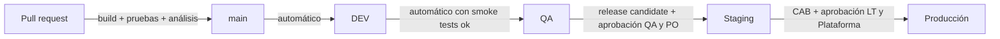

# Proceso de desarrollo

> Cómo trabaja el equipo para llegar a la versión 1.0 en 6 meses: marco Scrum, interacción con las áreas de soporte de TI, flujo de entornos DEV → QA → Staging → Producción, CI/CD y documentación técnica y funcional.
> Plan temporal y backlog: [backlog-roadmap.md](backlog-roadmap.md).

## 1. Equipo y responsabilidades

| Rol | Cantidad | Responsabilidades principales |
|---|---|---|
| Product Owner | 1 | Visión, priorización del backlog, criterios de aceptación, aceptación de historias, UAT |
| Scrum Master | 1 | Facilitación, remoción de impedimentos, métricas del equipo, coordinación de dependencias con las áreas de soporte |
| **Líder Técnico** | 1 | Visión y decisiones técnicas (ADR), diseño de arquitectura con el área de Arquitectura, estándares y revisiones de código, quality gates, estimación técnica, gestión de deuda y riesgo técnico, mentoría, interlocución técnica con las áreas de soporte |
| Backend | 2 | Microservicios .NET, mensajería, persistencia, pruebas unitarias y de integración |
| Frontend | 2 | Web cliente, backoffice y PWA de staff (React / Next.js), pruebas de componentes |
| FullStack | 1 | Funcionalidades de punta a punta, CI/CD y módulos Terraform de los servicios, integraciones (PSP, webhooks), apoyo a front y back |
| QA | 2 | Estrategia y plan de pruebas, automatización (API y E2E), regresión, pruebas de carga con el equipo, soporte en UAT |
| UX | 1 | Investigación, journeys, arquitectura de información, prototipos, pruebas de usabilidad |
| UI | 1 | Design system, diseño visual de alta fidelidad, accesibilidad visual, especificaciones para frontend |

**Capacidad de desarrollo:** 5 desarrolladores × ~8 SP/sprint ≈ **40 SP por sprint** en régimen. Se reduce en el Sprint 0 (arranque), en los sprints de fin de año y en los sprints de estabilización (ver hoja *Sprints* del Excel).

## 2. Marco Scrum (sprints de 2 semanas)

| Ceremonia | Cuándo | Duración | Participantes | Resultado |
|---|---|---|---|---|
| Sprint Planning | Día 1 del sprint | 3 h | Equipo Scrum | Objetivo del sprint + sprint backlog comprometido |
| Daily Scrum | Diario | 15 min | Desarrolladores, QA, LT (SM facilita) | Plan del día e impedimentos visibles |
| Refinamiento del backlog | Semanal | 1,5 h | PO, LT, representantes de dev, QA y UX | Historias en estado **Ready** para los próximos 2 sprints |
| Sprint Review | Último día | 1,5 h | Equipo + stakeholders + áreas de soporte invitadas | Incremento demostrado en **QA o Staging** y feedback |
| Retrospectiva | Último día | 1 h | Equipo Scrum | 1 a 3 acciones de mejora con responsable |
| Sincronización técnica con áreas de soporte | Semanal | 45 min | LT, SM, Arquitectura, BD, Seguridad, Plataforma | Solicitudes, aprobaciones y bloqueos del próximo sprint |
| Revisión de arquitectura | Al introducir un servicio o patrón nuevo | 1 h | LT + área de Arquitectura (+ Seguridad y BD según el tema) | ADR aprobado |

### 2.1 Definition of Ready (historia)
- Tiene valor claro para el usuario y criterios de aceptación en formato Gherkin (*Dado / Cuando / Entonces*).
- Tiene prototipo UX/UI aprobado cuando hay interfaz.
- Tiene contrato de API o evento esbozado cuando hay integración.
- Tiene las dependencias con áreas de soporte **solicitadas** y con fecha comprometida.
- Está estimada por el equipo, entra en un sprint y tiene definido su enfoque de pruebas.

### 2.2 Definition of Done
| Nivel | Criterios |
|---|---|
| **Historia** | Código revisado (PR aprobado); pruebas unitarias y de integración en verde; quality gate de Sonar aprobado (cobertura ≥ 70 % en dominio y aplicación, 0 bugs o vulnerabilidades críticas o altas); contrato OpenAPI o AsyncAPI actualizado; desplegada en **QA** por pipeline; casos de QA ejecutados sin defectos críticos ni altos; aceptada por el PO |
| **Sprint** | Incremento integrado y demostrable en QA; regresión automatizada en verde; documentación del sprint actualizada; deuda técnica registrada en el backlog |
| **Release** | Desplegado en **Staging** con datos realistas; UAT firmado; pruebas de carga y seguridad sin hallazgos críticos; runbooks y release notes publicados; aprobación del comité de cambios (CAB) |

## 3. Áreas de soporte de TI

### 3.1 Qué aporta cada área y cuándo se involucra

| Área | Aporte al proyecto | Momentos clave | *Lead time* de referencia* |
|---|---|---|---|
| **Arquitectura** | Revisión y aprobación del SAD y los ADR, lineamientos corporativos, gobierno de integraciones | Sprint 0 (aprobación base), cada servicio o patrón nuevo, pre go-live | 5 días hábiles por revisión |
| **Base de Datos** | Revisión de modelos y scripts, aprovisionamiento de RDS/Aurora y DynamoDB, respaldos y restauración, *tuning*, ejecución de scripts en Staging y Producción | Diseño de cada servicio, antes de cada release, pruebas de carga | 3 días hábiles por script o instancia |
| **Seguridad** | Modelo de amenazas, políticas IAM, WAF, reglas de firewall y *security groups*, gestión de secretos, SAST/DAST, pentest, aprobación de salida a producción | Sprint 0 (modelo de amenazas), IdP (Sprint 2), pagos (Sprints 6–7), pentest (Sprint 11) | 5 días hábiles por regla o política; pentest de 2 semanas |
| **Plataforma** | Landing zone y cuentas AWS, VPC y conectividad híbrida, módulos Terraform base, pipelines de despliegue, observabilidad, operación de producción | Sprints 0–1 (fundaciones), cada entorno nuevo, go-live e hipercuidado | 5–10 días hábiles por entorno |

\* A validar con cada área. Se usan para planificar las solicitudes **un sprint antes** de que sean necesarias.

### 3.2 Modelo de trabajo con las áreas
- **Historias habilitadoras** en el backlog (tipo *Soporte*) con responsable del área, fecha comprometida y la historia del equipo que desbloquean.
- **Solicitudes con un sprint de anticipación (N-1):** el SM y el LT revisan en el refinamiento qué necesita el sprint N+1 y abren los tickets a las áreas.
- **Autoservicio donde sea posible:** los módulos Terraform aprobados por Plataforma y Seguridad permiten que el equipo cree recursos de sus servicios por *pull request*, sin tickets manuales.
- **Invitación a Sprint Reviews** cuando el incremento las involucra (por ejemplo, Seguridad en la review del IdP).

### 3.3 Matriz RACI

R = Responsable · A = Aprueba · C = Consultado · I = Informado

| Actividad | PO | SM | LT | Dev (BE/FE/FS) | QA | UX/UI | Arquitectura | BD | Seguridad | Plataforma |
|---|---|---|---|---|---|---|---|---|---|---|
| Visión y priorización del backlog | A/R | C | C | I | I | C | I | I | I | I |
| Diseño de arquitectura (SAD, ADR) | I | I | R | C | I | I | A | C | C | C |
| Modelo de datos y scripts | I | I | A | R | I | I | C | C | I | I |
| Ejecución de scripts en Staging y Producción | I | I | C | C | I | I | I | A/R | I | C |
| Aprovisionamiento de nube / on-premise (IaC) | I | I | C | C | I | I | C | C | C | A/R |
| Firewall, WAF, IAM y políticas de seguridad | I | I | C | C | I | I | I | I | A | R |
| Modelo de amenazas y revisiones de seguridad | I | I | R | C | C | I | C | I | A | I |
| Pipelines de CI/CD | I | I | A | R | C | I | I | I | C | C |
| Desarrollo y pruebas unitarias | I | I | A | R | C | C | I | I | I | I |
| Revisión de código | I | I | A | R | I | I | I | I | I | I |
| Diseño UX/UI | A | I | C | C | C | R | I | I | I | I |
| Pruebas funcionales y regresión | C | I | C | C | A/R | I | I | I | I | I |
| Pruebas de carga y rendimiento | I | I | A | C | R | I | C | C | I | C |
| Pentest y remediación | I | I | C | R | C | I | I | I | A | C |
| UAT | A | C | C | C | R | C | I | I | I | I |
| Despliegue a producción | C | C | A | C | C | I | I | C | C | R |
| Ceremonias e impedimentos | C | A/R | C | C | C | C | I | I | I | I |
| Documentación funcional | A/R | I | C | C | C | C | I | I | I | I |
| Documentación técnica | I | I | A | R | C | I | C | C | C | C |
| Hipercuidado post go-live | I | C | A | R | C | I | I | C | C | R |

## 4. Entornos y promoción

| Entorno | Propósito | Despliegue | Datos | Valida | Puerta para promover |
|---|---|---|---|---|---|
| **DEV** | Integración continua del equipo | Automático en cada merge a `main` | Sintéticos | Desarrolladores | Build en verde, pruebas unitarias y de integración, quality gate |
| **QA** | Pruebas funcionales, de regresión y de API automatizadas | Automático tras los smoke tests de DEV (o por lote diario) | Sintéticos controlados (seed) | QA | Casos del sprint ejecutados, 0 defectos críticos o altos abiertos |
| **Staging** | Réplica de producción: UAT, carga, seguridad (DAST y pentest), ensayo de despliegue y *rollback* | Manual con aprobación: *release candidate* etiquetado | Anonimizados con volumen realista | PO / negocio, QA, Seguridad, Plataforma | UAT firmado, pruebas de carga ok, sin hallazgos críticos, CAB aprobado |
| **Producción** | Operación | *Blue/green* (ECS) con *rollback* automático por alarmas | Reales | Plataforma + LT | Smoke tests post-despliegue y monitoreo reforzado de 24 h |

**Principios**
- **Se construye una vez y se despliega muchas:** la misma imagen (por digest) se promueve entre entornos. Solo cambia la configuración (Parameter Store / Secrets Manager).
- **Cuentas AWS separadas por entorno** y los mismos módulos Terraform en todas (paridad).
- **Migraciones de BD compatibles hacia atrás** (*expand / contract*): se aplican desde el pipeline antes del despliegue, nunca al arrancar la aplicación fuera de DEV. En Staging y Producción las ejecuta o aprueba el área de BD.
- **Feature flags** (AWS AppConfig) para integrar código incompleto sin bloquear releases.

## 5. Flujo de código y CI/CD

### 5.1 Ramas y revisión
- **Trunk-based development:** ramas cortas (`feature/BL-123-descripcion`, 1 a 3 días de vida) hacia `main`.
- **Pull requests** con al menos 1 aprobación (2 en cambios de dominio crítico, seguridad o pagos; una de ellas del LT o de un senior designado). Se integran con *squash merge*.
- **Conventional Commits** y **SemVer** por servicio (`event-service v1.4.0`). Etiquetas de release en `main` y ramas `hotfix/*` desde la etiqueta de producción.

### 5.2 Etapas del pipeline

| # | Etapa | Herramientas de referencia | Falla el pipeline si… |
|---|---|---|---|
| 1 | Build y pruebas unitarias | `dotnet build/test`, `npm test` | Una prueba falla |
| 2 | Análisis estático y cobertura | SonarQube / SonarCloud | No pasa el quality gate |
| 3 | Seguridad del código | SAST, SCA (dependencias), *secret scanning* (gitleaks) | Hay vulnerabilidades críticas o altas, o un secreto expuesto |
| 4 | Pruebas de integración | Testcontainers | Una prueba falla |
| 5 | Imagen de contenedor | `docker build`, escaneo (Trivy / Inspector), firma, *push* a ECR | Hay CVE críticas |
| 6 | Infraestructura | `terraform fmt/validate/plan` + tfsec / checkov | Hay errores o políticas incumplidas |
| 7 | Despliegue a DEV → QA | `terraform apply` + actualización del servicio ECS | Fallan los smoke tests |
| 8 | Pruebas automatizadas en QA | API (Postman/Newman o Playwright), E2E (Playwright) | Hay regresiones |
| 9 | Staging (aprobación manual) | DAST (OWASP ZAP), carga (k6) | Hay hallazgos críticos o no se cumplen los SLO |
| 10 | Producción (aprobación del CAB) | *Blue/green* + smoke tests + *rollback* automático | Se disparan alarmas |

### 5.3 Infraestructura como código (Terraform)
- Repositorio de **módulos base** (VPC, ECS, Aurora, SQS/SNS, observabilidad), mantenido por **Plataforma** y aprobado por **Seguridad**.
- Cada servicio declara sus recursos (cola, tabla, *task definition*) usando esos módulos, en la carpeta `infra/` de su repositorio.
- Estado remoto en S3 con bloqueo, uno por entorno y cuenta. `plan` visible en el PR; `apply` solo desde el pipeline.

## 6. Estrategia de calidad

| Tipo de prueba | Responsable | Entorno | Automatizada | Frecuencia |
|---|---|---|---|---|
| Unitarias (dominio, aplicación, componentes) | Desarrolladores | CI | Sí | Cada PR |
| Integración (BD, broker, caché con Testcontainers) | Desarrolladores | CI | Sí | Cada PR |
| Contrato (API y eventos) | Desarrolladores + QA | CI | Sí | Cada PR |
| API y E2E funcionales | QA | QA | Sí (regresión) | Cada despliegue en QA |
| Exploratorias | QA | QA | No | Cada historia |
| Rendimiento y carga (preventa simulada) | QA + BE + Plataforma | Staging | Sí (k6) | Desde el Sprint 5; formal en el Sprint 11 |
| Seguridad (SAST, SCA, DAST, pentest) | Seguridad + equipo | CI / Staging | Parcial | Continuo; pentest en el Sprint 11 |
| Accesibilidad (WCAG 2.1 AA) | UX/UI + FE + QA | QA | Parcial (axe) | Cada historia con interfaz |
| Resiliencia y recuperación ante desastres | Plataforma + LT | Staging | Parcial | Sprint 11 |
| UAT | PO + negocio (QA apoya) | Staging | No | Sprint 12 |

## 7. Documentación técnica y funcional

| Documento | Tipo | Responsable | Aprueba | Cuándo |
|---|---|---|---|---|
| Visión del producto, objetivos y KPI | Funcional | PO | Sponsor | Sprint 0 |
| Mapa de historias y roadmap | Funcional | PO + LT + SM | Sponsor | Sprint 0 (vivo) |
| Historias de usuario con criterios Gherkin | Funcional | PO | PO | Continuo (DoR) |
| Reglas de negocio (venta, aforos, reembolsos, check-in) | Funcional | PO | Negocio | Sprints 1–7 |
| Prototipos UX y design system | Funcional | UX / UI | PO | Sprints 0–2 y por épica |
| Documento de arquitectura (SAD, C4) + ADR | Técnico | LT | Arquitectura | Sprint 0 (vivo) |
| Modelo de amenazas y requisitos de seguridad | Técnico | LT + Seguridad | Seguridad | Sprint 0; se actualiza por épica |
| Modelo de datos y diccionario de datos por servicio | Técnico | Dev + LT | BD | Por servicio |
| Contratos de API (OpenAPI) y catálogo de eventos (AsyncAPI) | Técnico | Dev | LT | Por historia |
| Diseño de infraestructura y módulos Terraform | Técnico | Plataforma + FS | Arquitectura + Seguridad | Sprints 0–1 |
| Estrategia y plan de pruebas, informes por sprint | Técnico | QA | LT + PO | Sprint 1; por sprint |
| Plan e informe de pruebas de carga | Técnico | QA + BE | LT | Sprint 11 |
| Informe de pentest y plan de remediación | Técnico | Seguridad | Seguridad | Sprint 11 |
| Runbooks, playbooks de incidentes y manual de despliegue | Técnico | FS + Plataforma | Plataforma | Sprints 10–12 |
| Plan de recuperación ante desastres y continuidad | Técnico | Plataforma + LT | Arquitectura | Sprint 11 |
| Manuales de usuario (cliente, promotor, staff, admin) | Funcional | PO + UX + QA | PO | Sprints 10–12 |
| Plan y acta de UAT | Funcional | PO + QA | Negocio | Sprint 12 |
| Checklist de go-live y plan de *rollback* | Técnico | LT + SM | CAB | Sprint 12 |
| Release notes | Funcional | PO + SM | PO | Cada release |
| README y guía de contribución por repositorio | Técnico | Dev | LT | Sprint 0 (vivo) |

> **Docs as code:** la documentación técnica vive en el repositorio (Markdown + Mermaid) y se revisa en los PR igual que el código. La funcional vive en la herramienta del equipo (Confluence, Notion o similar) con enlaces cruzados.

## 8. Métricas de seguimiento

| Métrica | Uso |
|---|---|
| Velocidad y cumplimiento del objetivo de sprint | Previsibilidad del plan |
| Burn-up del release 1.0 (SP completados vs. alcance) | Proyección de la fecha de salida y decisiones de alcance |
| DORA: frecuencia de despliegue, *lead time*, tasa de fallo de cambios, MTTR | Salud del flujo de entrega |
| Defectos escapados a Staging y Producción | Calidad del proceso de pruebas |
| Deuda técnica (Sonar) y vulnerabilidades abiertas | Salud técnica |
| Solicitudes a áreas de soporte fuera de plazo | Riesgo de dependencias |
